# Entity Framework - sprawozdanie

**Imiona i nazwiska autorów: Jakub Psarski, Dariusz Rozmus**

# 1. Wprowadzenie

## 1.1. Setup projektu
Stworzenie nowej aplikacji konsolowej:

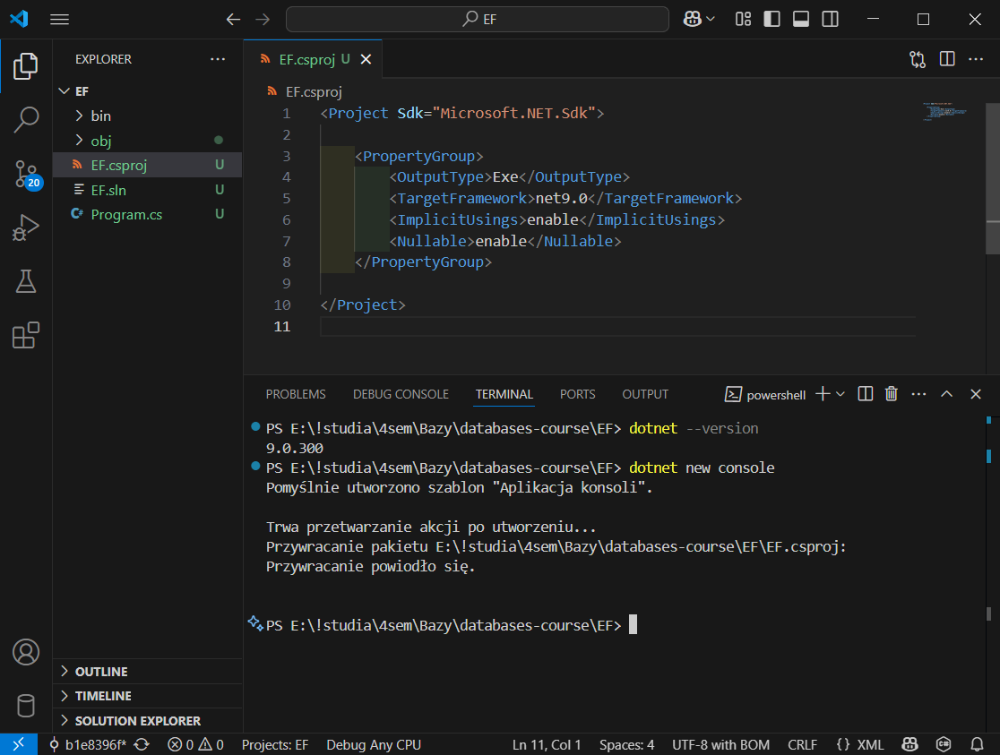

Zbudowanie i uruchomienie przykładowego programu:

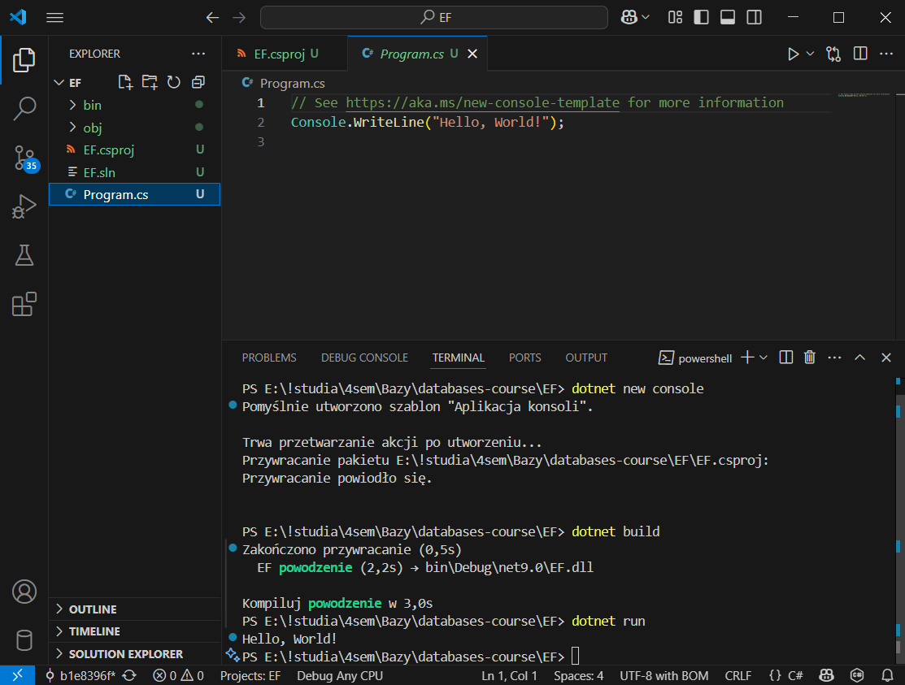

<div style="page-break-after: always"></div>

## 1.2. Dodanie klas i budowanie projektu

Product.cs:

```cs
public class Product
{
    public int ProductID { get; set; }
    public String? ProductName { get; set; }
    public int UnitsInStock { get; set; }
}
```

ProdContext.cs:

```cs
using Microsoft.EntityFrameworkCore;

public class ProdContext: DbContext
{
    public DbSet<Product> Products { get; set; }

    protected override void OnConfiguring(DbContextOptionsBuilder optionsBuilder)
    {
        base.OnConfiguring(optionsBuilder);
        optionsBuilder.UseSqlite("Datasource=MyProductDatabase");
    }
}
```

Konfigurację środowiska (instalację wymaganych paczek) wykonaliśmy przed rozpoczęciem pisania sprawozdania, więc poniżej prezentujemy proces budowania projektu, utworzenia kodu migracji i utworzenia bazy danych z właściwą konfiguracją:

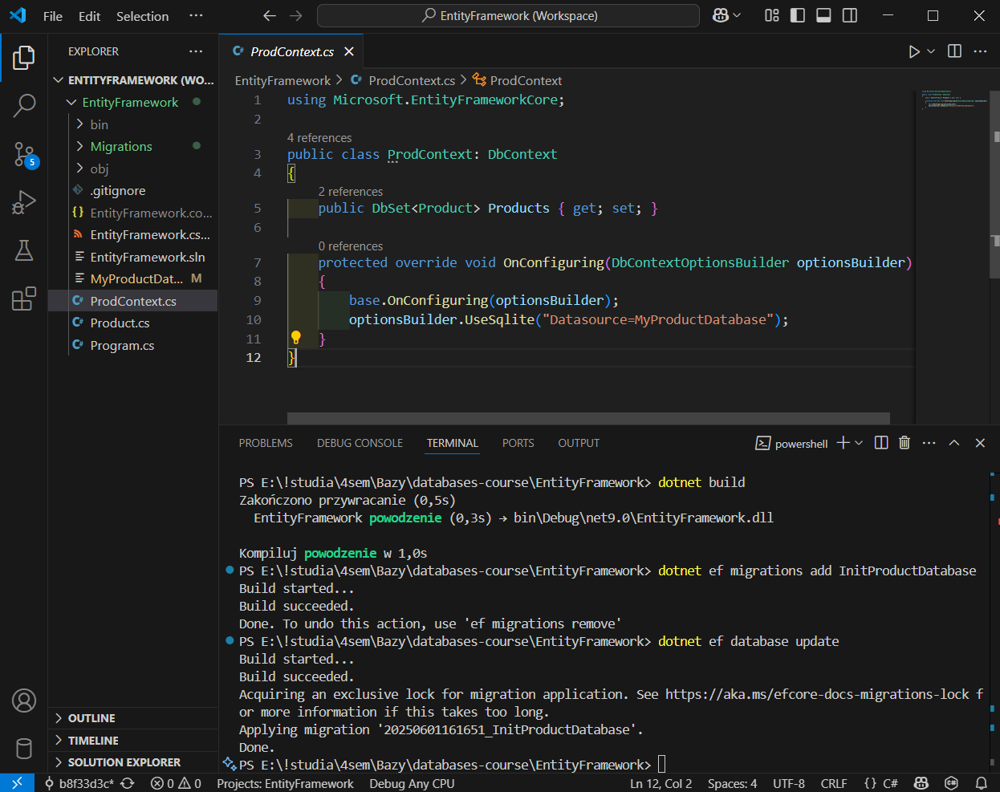

## 1.3. Dodawanie produktu do bazy oraz wyświetlanie danych

Program.cs:

```cs
using System;
using System.Linq;
ProdContext prodContext = new ProdContext();
Console.WriteLine("Enter product name:");
String? prodName = Console.ReadLine();
Product product = new Product {ProductName = prodName};
prodContext.Products.Add(product);
prodContext.SaveChanges();

var query = from prod in prodContext.Products
            select prod.ProductName;

Console.WriteLine("\nProducts in the database:");

foreach (var pName in query)
{
    Console.WriteLine(pName);
}
```

Wykonanie:

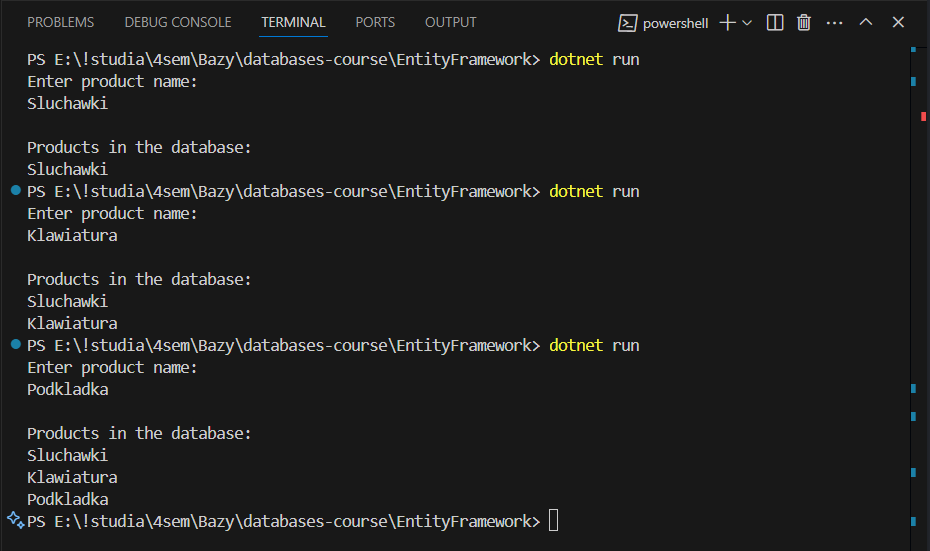

Zawartość bazy danych:

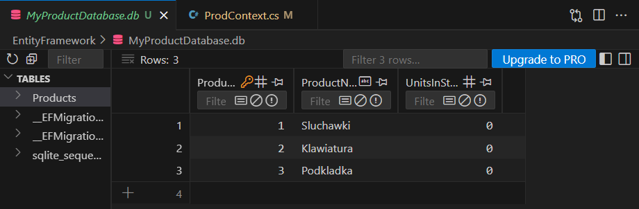

# 2. Zadania

## 2.1. Wprowadzenie pojęcia dostawcy

Supplier.cs:

```cs
public class Supplier{
    public int SupplierID { get; set; }
    public string? CompanyName { get; set; }
    public string? Street { get; set; }
    public string? City { get; set; }
    public override string? ToString(){
        return CompanyName;
    }
}
```

Product.cs:

```cs
public class Product
{
    public int ProductID { get; set; }
    public string? ProductName { get; set; }
    public int UnitsInStock { get; set; }
    public Supplier? Supplier { get; set; } = null;
    public override string ToString(){
        if (ProductName == null)
        {
            return "No product name";
        }
        if (Supplier != null && Supplier.CompanyName != null)
        {
            return $"{ProductName} - {UnitsInStock}pcs, Supplier: {Supplier.CompanyName}";
        }
        return $"{ProductName} - {UnitsInStock}pcs";
    }
}
```

ProdContext.cs:

```cs
using Microsoft.EntityFrameworkCore;

public class ProdContext: DbContext
{
    public DbSet<Product> Products { get; set; }
    public DbSet<Supplier> Suppliers { get; set; }
    protected override void OnConfiguring(DbContextOptionsBuilder optionsBuilder)
    {
        base.OnConfiguring(optionsBuilder);
        optionsBuilder.UseSqlite("Datasource=MyProductDatabase.db");
    }
}
```

<div style="page-break-after: always"></div>

Program.cs:

```cs
class Program
{
    static void Main()
    {
        var dbContext = new ProdContext();
        var newProduct = GetProductDetails();

        bool addedNewSupplier = SupplierSelection(dbContext, out Supplier? selectedSupplier);

        Console.WriteLine("Adding supplier to product...");
        newProduct.Supplier = selectedSupplier;

        Console.WriteLine("Saving data...");
        SaveToDatabase(dbContext, newProduct, selectedSupplier, addedNewSupplier);
    }
    
    private static bool SupplierSelection(ProdContext db, out Supplier? selectedSupplier)
    {
        bool createdNew = false;
        
        while (true)
        {
            Console.WriteLine("Do you want to add a new supplier? (y/n; default: n)");
            var response = Console.ReadLine()?.ToLower() ?? "";
            
            if (response == "y")
            {
                selectedSupplier = GetSupplierDetails();
                createdNew = true;
                break;
            }
            else if (response == "n" || response == "")
            {
                ShowSuppliers(db);
                selectedSupplier = SelectExistingSupplier(db);
                break;
            }
        }
        
        return createdNew;
    }
    
    private static void SaveToDatabase(
        ProdContext db,
        Product product,
        Supplier? supplier,
        bool isNewSupplier)
    {
        if (isNewSupplier && supplier != null)
        {
            db.Suppliers.Add(supplier);
        }
        db.Products.Add(product);
        db.SaveChanges();
    }
    
    private static Product GetProductDetails()
    {
        Console.Write("Enter product name\n>>> ");
        string name = Console.ReadLine() ?? "";
        
        int stock;
        string input;
        do
        {
            Console.Write("Enter number of items in stock\n>>> ");
            input = Console.ReadLine() ?? "";
        } while (string.IsNullOrEmpty(input) || !int.TryParse(input, out stock));
        
        Console.WriteLine("Creating new product...");
        var newProduct = new Product
        {
            ProductName = name,
            UnitsInStock = stock
        };
        
        Console.WriteLine($"Created product: {newProduct}");
        return newProduct;
    }
    
    private static Supplier GetSupplierDetails()
    {
        Console.Write("\nEnter supplier name\n>>> ");
        string name = Console.ReadLine() ?? "";
        
        Console.Write("Enter city name\n>>> ");
        string city = Console.ReadLine() ?? "";
        
        Console.Write("Enter street name\n>>> ");
        string street = Console.ReadLine() ?? "";
        
        Console.WriteLine("Creating new supplier...");
        var newSupplier = new Supplier
        {
            CompanyName = name,
            City = city,
            Street = street
        };
        
        Console.WriteLine($"Created supplier: {newSupplier}");
        return newSupplier;
    }
    
    private static Supplier? SelectExistingSupplier(ProdContext db)
    {
        int supplierId = 0;
        string input;
        
        do
        {
            Console.Write("Enter shipper ID for the new product\n>>> ");
            input = Console.ReadLine() ?? "";
        } while (string.IsNullOrEmpty(input) || !int.TryParse(input, out supplierId));
        
        return db.Suppliers
            .Where(s => s.SupplierID == supplierId)
            .FirstOrDefault();
    }
    
    private static void ShowSuppliers(ProdContext db)
    {
        Console.WriteLine("Supplier list:");
        foreach (var supplier in db.Suppliers)
        {
            Console.WriteLine($"[{supplier.SupplierID}] {supplier}");
        }
    }
}
```

<div style="page-break-after: always"></div>

Przykład działania:

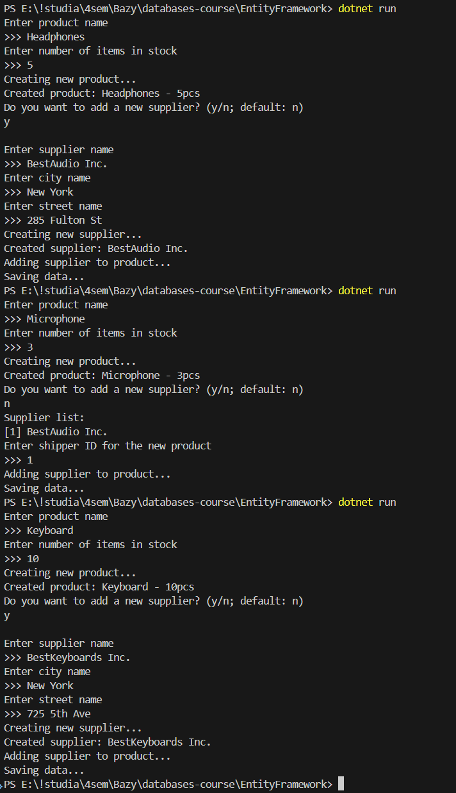

<div style="page-break-after: always"></div>

Zawartość tabel:

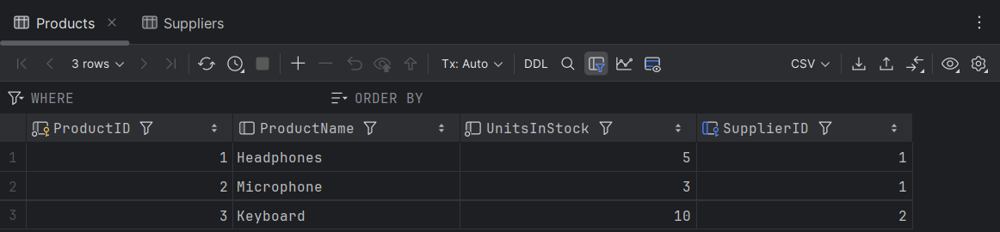

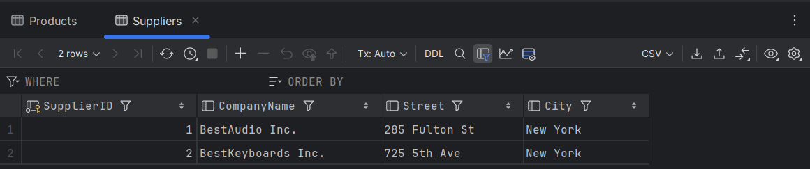

Schemat bazy danych:

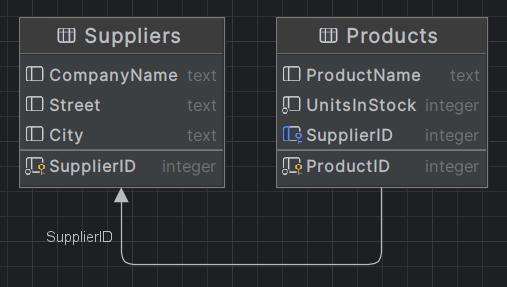

<div style="page-break-after: always"></div>

## 2.2. Odwrócenie relacji dostawca-produkt

Supplier.cs:

```cs
public class Supplier
{
    public int SupplierID { get; set; }
    public string? CompanyName { get; set; }
    public string? Street { get; set; }
    public string? City { get; set; }
    public List<Product> Products { get; set; } = [];
    public override string? ToString(){
        return CompanyName;
    }
}
```

Product.cs: 

```cs
public class Product
{
    public int ProductID { get; set; }
    public string? ProductName { get; set; }
    public int UnitsInStock { get; set; }
    public override string ToString(){
        if (ProductName == null)
        {
            return "No product name";
        }
        return $"{ProductName} - {UnitsInStock}pcs";
    }
}
```

Program.cs:

```cs
(...)
        Console.WriteLine("Adding product to supplier...");
        selectedSupplier?.Products.Add(newProduct);
        // ^tylko te dwie linijki zostały zmienione względem poprzedniego podpunktu
(...)
```

Schemat bazy danych:

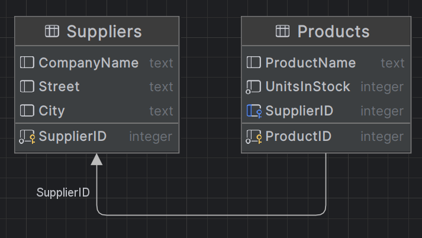

Pomimo odwrócenia relacji w kodzie, w bazie danych jest ona reprezentowana w ten sam sposób, jak w poprzednim podpunkcie. Dzieje się tak dzięki optymalizacji wykonywanej przez Entity Framework przy tworzeniu kodu migracji - w oby przypadkach EF analizuje oba końce relacji i ustala, że to relacja jeden-do-wielu, gdzie Products zawiera klucz obcy do Suppliers.

## 2.3. Dwustronna relacja dostawca-produkt

Product.cs: 

```cs
public class Product
{
    public int ProductID { get; set; }
    public string? ProductName { get; set; }
    public int UnitsInStock { get; set; }
    public Supplier? Supplier { get; set; } = null;
    public override string ToString(){
        if (ProductName == null)    
        {
            return "No product name";
        }
        if (Supplier != null && Supplier.CompanyName != null)
        {
            return $"{ProductName} - {UnitsInStock}pcs, Supplier: {Supplier.CompanyName}";
        }
        return $"{ProductName} - {UnitsInStock}pcs";
    }
}
```

Program.cs:

```cs
(...)
        Console.WriteLine("Adding product to supplier...");
        if (selectedSupplier != null)
        {
            selectedSupplier.Products.Add(newProduct);
            newProduct.Supplier = selectedSupplier;
        }
        // ^podobnie, jak w poprzednim przypadku, zmianie uległ tylko ten fragment
(...)
```

Schemat bazy danych:

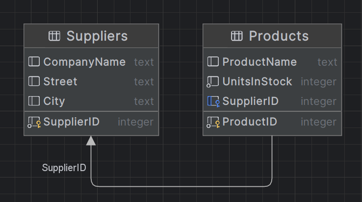

Również w tym przypadku zmiana w kodzie nie wpływa na faktyczną strukturę tworzonej bazy danych. Można z tego wywnioskować, że Entity Framework daje dużą swobodę w zarządzaniu obiektami w kodzie, przekształcając i optymalizując relacje na poziomie migracji.

## 2.4. Faktury - relacja wiele-wiele

Invoice.cs:

```cs
namespace EntityFramework;

public class Invoice
{
    public int InvoiceID { get; set; }
    public string? InvoiceNumber { get; set; }
    public List<InvoiceProduct> Products { get; set; } = [];
    
    public override string? ToString()
    {
        return $"Invoice {InvoiceNumber}";
    }
}
```

InvoiceProduct.cs:

```cs
namespace EntityFramework;

public class InvoiceProduct
{
    public int InvoiceID { get; set; }
    public int ProductID { get; set; }
    public Invoice? Invoice { get; set; }
    
    public Product? Product { get; set; }
    
    public int Quantity { get; set; }
    
    public override string? ToString()
    {
        return $"{Product?.ProductName} - {Quantity} pcs";
    }
}
```

Product.cs:

```cs
namespace EntityFramework;
public class Product
{
    public int ProductID { get; set; }
    public string? ProductName { get; set; }
    public int UnitsInStock { get; set; }
    public Supplier? Supplier { get; set; } = null;
    public List<InvoiceProduct> Invoices { get; set; } = [];
    public override string ToString(){
        if (ProductName == null)    
        {
            return "No product name";
        }
        if (Supplier != null && Supplier.CompanyName != null)
        {
            return $"{ProductName} - {UnitsInStock}pcs, Supplier: {Supplier.CompanyName}";
        }
        return $"{ProductName} - {UnitsInStock}pcs";
    }
}
```

ProdContext.cs:

```cs
using Microsoft.EntityFrameworkCore;
using EntityFramework;

public class ProdContext: DbContext
{
    public DbSet<Product> Products { get; set; }
    public DbSet<Supplier> Suppliers { get; set; }
    public DbSet<Invoice> Invoices { get; set; }
    public DbSet<InvoiceProduct> InvoiceProducts { get; set; }
    
    protected override void OnConfiguring(DbContextOptionsBuilder optionsBuilder)
    {
        base.OnConfiguring(optionsBuilder);
        optionsBuilder.UseSqlite("Datasource=MyProductDatabase.db");
    }
    protected override void OnModelCreating(ModelBuilder modelBuilder)
    {
        modelBuilder.Entity<InvoiceProduct>()
            .HasKey(ip => new { ip.InvoiceID, ip.ProductID });
    }
}
```
Program.cs:

```cs
using Microsoft.EntityFrameworkCore;
using EntityFramework;

class Program
{
    static void Main()
    {
        var dbContext = new ProdContext();
        bool exit = false;
        
        while (!exit)
        {
            Console.WriteLine("Choose an operation:");
            Console.WriteLine("1. Add a new product with supplier");
            Console.WriteLine("2. Create a new invoice");
            Console.WriteLine("3. Show products for an invoice");
            Console.WriteLine("4. Show invoices for a product");
            Console.WriteLine("5. Exit");
            Console.Write(">>> ");
            
            string? choice = Console.ReadLine();
            
            switch(choice)
            {
                case "1":
                    AddProductWithSupplier(dbContext);
                    break;
                case "2":
                    CreateInvoice(dbContext);
                    break;
                case "3":
                    ShowProductsForInvoice(dbContext);
                    break;
                case "4":
                    ShowInvoicesForProduct(dbContext);
                    break;
                case "5":
                    exit = true;
                    break;
                default:
                    Console.WriteLine("Unknown option");
                    break;
            }
        }
    }
    
    static void AddProductWithSupplier(ProdContext dbContext)
    {
        var newProduct = GetProductDetails();

        bool addedNewSupplier = SupplierSelection(dbContext, out Supplier? selectedSupplier);

        Console.WriteLine("Adding product to supplier...");
        if (selectedSupplier != null)
        {
            selectedSupplier.Products.Add(newProduct);
            newProduct.Supplier = selectedSupplier;
        }

        Console.WriteLine("Saving data...");
        SaveToDatabase(dbContext, newProduct, selectedSupplier, addedNewSupplier);
    }

    (...)

    private static void CreateInvoice(ProdContext db)
    {
        Console.Write("Enter invoice number\n>>> ");
        string invoiceNumber = Console.ReadLine() ?? "";

        var invoice = new Invoice { InvoiceNumber = invoiceNumber };
        db.Invoices.Add(invoice);
        db.SaveChanges();

        bool addMoreProducts = true;
        while (addMoreProducts)
        {
            Console.WriteLine("\nProduct list:");
            foreach (var product in db.Products)
            {
                Console.WriteLine($"[{product.ProductID}] {product}");
            }

            Console.Write("\nEnter product ID to add to invoice (0 to finish)\n>>> ");
            if (int.TryParse(Console.ReadLine(), out int productId) && productId > 0)
            {
                var product = db.Products.Find(productId);
                if (product != null)
                {
                    Console.Write($"Enter quantity for {product.ProductName}\n>>> ");
                    if (int.TryParse(Console.ReadLine(), out int quantity) && quantity > 0)
                    {
                        var invoiceProduct = new InvoiceProduct
                        {
                            Invoice = invoice,
                            Product = product,
                            Quantity = quantity
                        };
                        
                        invoice.Products.Add(invoiceProduct);
                        product.Invoices.Add(invoiceProduct);
                        
                        db.InvoiceProducts.Add(invoiceProduct);
                        Console.WriteLine($"Added {quantity} of {product.ProductName} to invoice");
                    }
                }
                else
                {
                    Console.WriteLine("Product not found!");
                }
            }
            else
            {
                addMoreProducts = false;
            }
        }
        
        db.SaveChanges();
        Console.WriteLine($"Invoice {invoice.InvoiceNumber} saved \
        with {invoice.Products.Count} products.");
    }
    
    private static void ShowProductsForInvoice(ProdContext db)
    {
        Console.WriteLine("Invoice list:");
        foreach (var invoice in db.Invoices)
        {
            Console.WriteLine($"[{invoice.InvoiceID}] {invoice.InvoiceNumber}");
        }
        Console.Write("\nEnter invoice ID to view products\n>>> ");
        if (int.TryParse(Console.ReadLine(), out int invoiceId))
        {
            var invoice = db.Invoices
                .Include(i => i.Products)
                .ThenInclude(ip => ip.Product)
                .FirstOrDefault(i => i.InvoiceID == invoiceId);
            
            if (invoice != null)
            {
                Console.WriteLine($"\nProducts in invoice {invoice.InvoiceNumber}:");
                foreach (var item in invoice.Products)
                {
                    Console.WriteLine($"- {item.Product?.ProductName}: {item.Quantity} pcs");
                }
            }
            else
            {
                Console.WriteLine("Invoice not found!");
            }
        }
    }
    
    private static void ShowInvoicesForProduct(ProdContext db)
    {
        Console.WriteLine("Product list:");
        foreach (var product in db.Products)
        {
            Console.WriteLine($"[{product.ProductID}] {product.ProductName}");
        }

        Console.Write("\nEnter product ID to view invoices\n>>> ");
        if (int.TryParse(Console.ReadLine(), out int productId))
        {
            var product = db.Products
                .Include(p => p.Invoices)
                .ThenInclude(ip => ip.Invoice)
                .FirstOrDefault(p => p.ProductID == productId);
            
            if (product != null)
            {
                Console.WriteLine($"\nInvoices containing {product.ProductName}:");
                foreach (var item in product.Invoices)
                {
                    Console.WriteLine($"- Invoice {item.Invoice?.InvoiceNumber}: {item.Quantity} pcs");
                }
            }
            else
            {
                Console.WriteLine("Product not found!");
            }
        }
    }
}
```

Dodanie faktury:

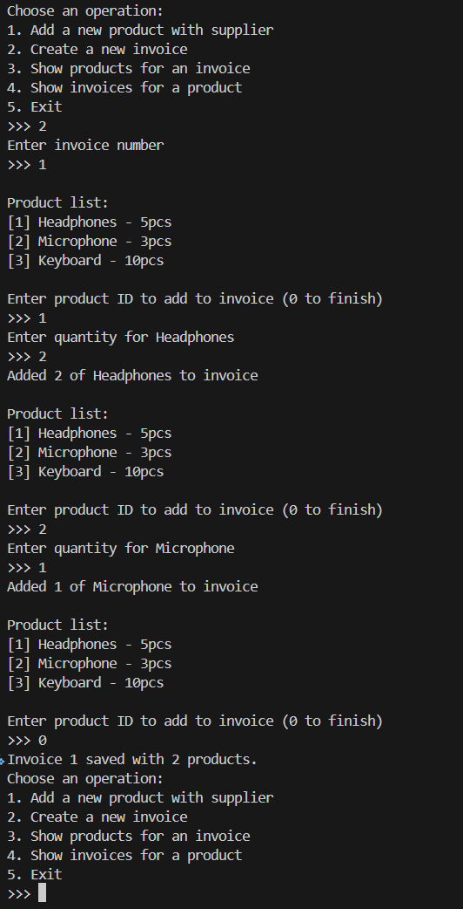

<div style="page-break-after: always"></div>

Wyświetlenie produktów oraz faktur:

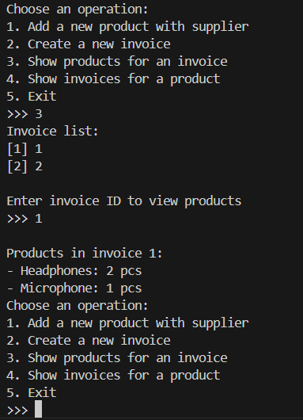
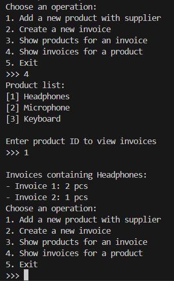

Schemat bazy danych:

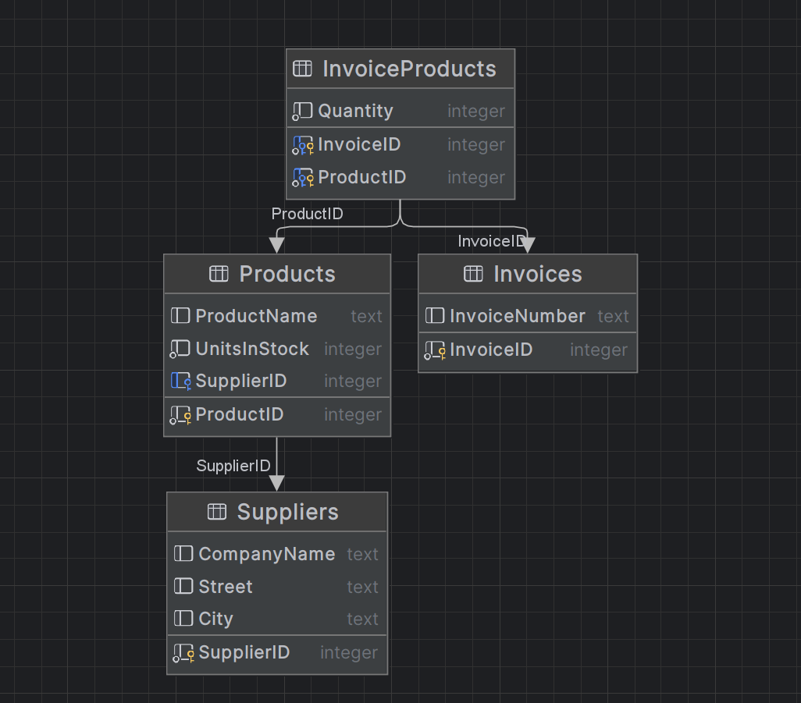

InvoiceProducts - tabela łącznikowa między fakturami a przedmiotami.

<div style="page-break-after: always"></div>

## 2.5. Hierarchia dziedziczenia - Table-Per-Hierarchy

Company.cs:

```cs
namespace EntityFramework;

public class Company
{
    public int CompanyID { get; set; }
    public string? CompanyName { get; set; }
    public string? Street { get; set; }
    public string? City { get; set; }
    public string? ZipCode { get; set; }
    
    public override string? ToString()
    {
        return CompanyName;
    }
}
```

Customer.cs:

```cs
namespace EntityFramework;

public class Customer : Company
{
    public decimal Discount { get; set; } = 0;
}
```

Supplier.cs:

```cs
namespace EntityFramework;

public class Supplier : Company
{
    public string? BankAccountNumber { get; set; }
    public List<Product> Products { get; set; } = [];
}
```

ProdContext.cs:

```cs
using Microsoft.EntityFrameworkCore;
using EntityFramework;

public class ProdContext: DbContext
{
    public DbSet<Product> Products { get; set; }
    public DbSet<Company> Companies { get; set; }
    public DbSet<Supplier> Suppliers { get; set; }
    public DbSet<Customer> Customers { get; set; }
    public DbSet<Invoice> Invoices { get; set; }
    public DbSet<InvoiceProduct> InvoiceProducts { get; set; }
    
    protected override void OnConfiguring(DbContextOptionsBuilder optionsBuilder)
    {
        base.OnConfiguring(optionsBuilder);
        optionsBuilder.UseSqlite("Datasource=MyProductDatabase.db");
    }
    protected override void OnModelCreating(ModelBuilder modelBuilder)
    {
        modelBuilder.Entity<InvoiceProduct>()
            .HasKey(ip => new { ip.InvoiceID, ip.ProductID });

        modelBuilder.Entity<Company>()
            .HasDiscriminator<string>("CompanyType")
            .HasValue<Company>("Company")
            .HasValue<Supplier>("Supplier")
            .HasValue<Customer>("Customer");
    }
}
```

Program.cs:

```cs
(...)
    private static void AddCustomer(ProdContext db)
    {
        Console.Write("\nEnter customer name\n>>> ");
        string name = Console.ReadLine() ?? "";
        Console.Write("Enter city name\n>>> ");
        string city = Console.ReadLine() ?? "";
        Console.Write("Enter street name\n>>> ");
        string street = Console.ReadLine() ?? "";
        Console.Write("Enter zip code\n>>> ");
        string zipCode = Console.ReadLine() ?? "";
        Console.Write("Enter discount (0-100%)\n>>> ");
        if (decimal.TryParse(Console.ReadLine(), out decimal discount))
        {
            Console.WriteLine("Creating new customer...");
            var newCustomer = new Customer
            {
                CompanyName = name,
                City = city,
                Street = street,
                ZipCode = zipCode,
                Discount = discount / 100
            };
            Console.WriteLine($"Created customer: {newCustomer.CompanyName} \
            with {newCustomer.Discount:P} discount");
            db.Customers.Add(newCustomer);
            db.SaveChanges();
        }
    }
    
    private static void ShowAllCompanies(ProdContext db)
    {
        Console.WriteLine("\nAll Companies:");
        Console.WriteLine("Suppliers:");
        foreach (var supplier in db.Suppliers)
        {
            Console.WriteLine($"- {supplier.CompanyName} (ID: {supplier.CompanyID}) - \
            Bank Account: {supplier.BankAccountNumber ?? "Not provided"}");
        }
        Console.WriteLine("\nCustomers:");
        foreach (var customer in db.Customers)
        {
            Console.WriteLine($"- {customer.CompanyName} (ID: {customer.CompanyID}) - \
            Discount: {customer.Discount:P}");
        }
    }
}
```

<div style="page-break-after: always"></div>

Dodawanie dostawcy i klienta:

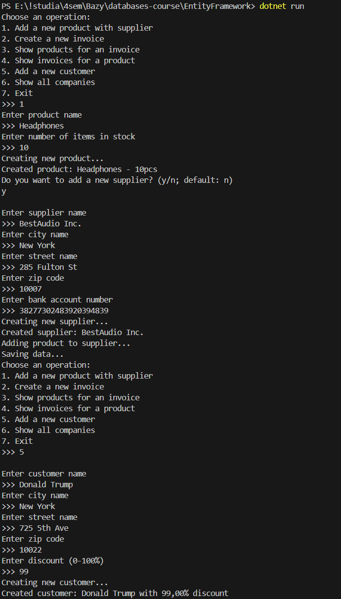

<div style="page-break-after: always"></div>

Wyświetlanie firm:

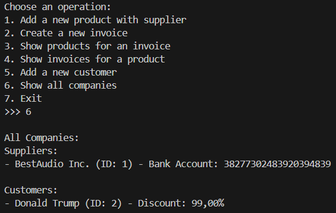

Schemat bazy danych:

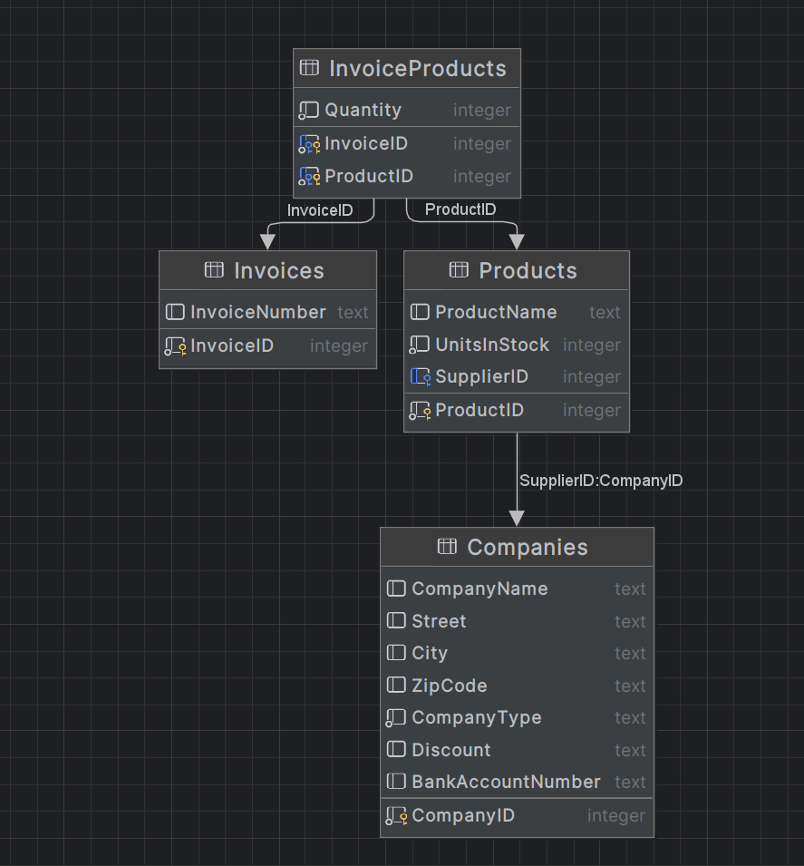

Zawartość tabeli Companies:

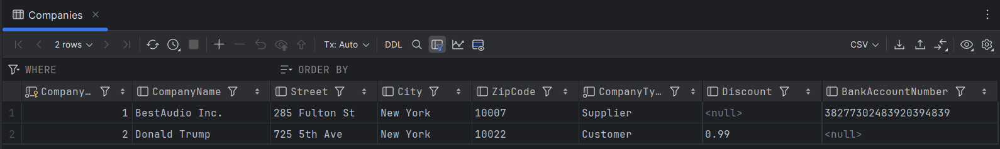

Tabela Companies zawiera zarówno dostawców, jak i klientów. Informacja o tym, czy dana firma jest dostawcą czy klientem, znajduje się w kolumnie CompanyType.

Niektóre kolumny w tabeli dotyczą tylko jednego typu firm – na przykład kolumna Discount odnosi się tylko do klientów. Dlatego dla firm, których dana kolumna nie dotyczy (np. dla dostawców w kolumnie Discount), pojawia się tam wartość `null`.

## 2.6. Hierarchia dziedziczenia - Table-Per-Type

Jedyna zmiana w kodzie ma miejsce w klasie ProdContext:

```cs
(...)
    protected override void OnModelCreating(ModelBuilder modelBuilder)
    {
        modelBuilder.Entity<InvoiceProduct>()
            .HasKey(ip => new { ip.InvoiceID, ip.ProductID });

        modelBuilder.Entity<Company>().ToTable("Companies");
        modelBuilder.Entity<Supplier>().ToTable("Suppliers");
        modelBuilder.Entity<Customer>().ToTable("Customers");
    }
}
```

Schemat bazy danych:

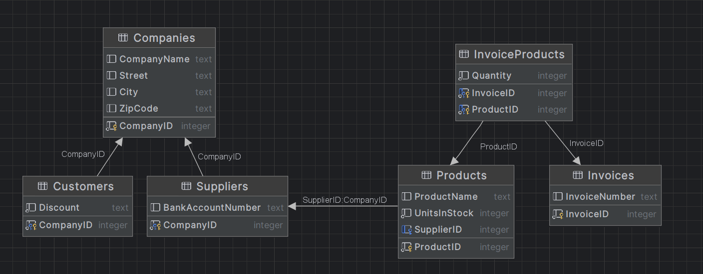

<div style="page-break-after: always"></div>

Zawartość tabel:

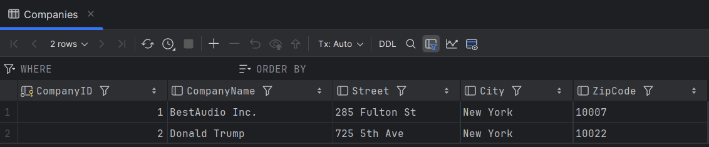

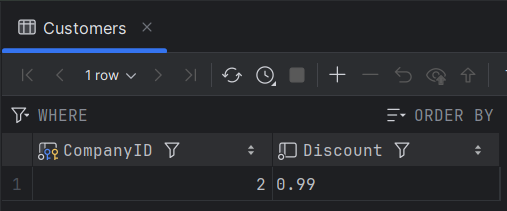

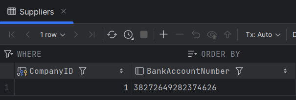

W tym przypadku w tabeli Companies znajdują się dane wspólne dla wszystkich rodzajów firm, a w tabelach odpowiadających poszczególnym typom firm znajdują się jedynie dane dotyczące tego konkretnego typu. Eliminuje to z tabeli Companies wartości `null`.

## 2.7. Porównanie strategii modelowania dziedziczenia

|  | **Table-Per-Hierarchy (TPH)** | **Table-Per-Type (TPT)** |
|--------|---------------------------|----------------------|
| **Zalety** | - Prostsze zapytania - brak JOIN-ów między tabelami<br> - Łatwiejsze dodawanie nowych właściwości do klasy bazowej | - Lepsze wykorzystanie miejsca - brak niepotrzebnych wartości `null`<br> - Lepsza normalizacja danych<br> - Możliwość nałożenia ograniczeń integralności na podklasy<br> - Bardziej intuicyjny schemat bazy danych |
| **Wady** | - Marnotrawstwo miejsca przez wartości `null`<br> - Ograniczenia integralności - wszystkie kolumny dotyczące podklas są nullable<br> - Tabela może stać się bardzo szeroka przy wielu podklasach<br> - Gorsza czytelność schematu | - Bardziej skomplikowane zapytania wymagające JOIN-ów<br> - Trudniejsze migracje przy zmianach w hierarchii |
| **Zastosowania** | - Płytka hierarchia (mało poziomów dziedziczenia)<br> - Podklasy mają podobne właściwości<br> - Wydajność zapytań jest priorytetem | - Podklasy znacznie różnią się właściwościami<br> - Integralność danych jest kluczowa<br> - Często wykonujesz zapytania specyficzne dla konkretnych podklas<br> - Schemat bazy danych musi być intuicyjny dla innych systemów |
