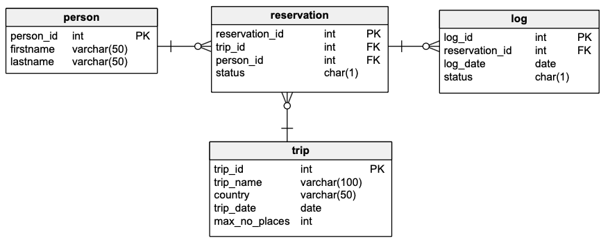

# Oracle PL/Sql

widoki, funkcje, procedury, triggery
ćwiczenie

---


Imiona i nazwiska autorów : Dariusz Rozmus, Jakub Psarski

---
<style>
  {
    font-size: 16pt;
  }
</style> 

<style scoped>
 li, p {
    font-size: 14pt;
  }
</style> 

<style scoped>
 pre {
    font-size: 10pt;
  }
</style> 

# Tabele




- `Trip`  - wycieczki
	- `trip_id` - identyfikator, klucz główny
	- `trip_name` - nazwa wycieczki
	- `country` - nazwa kraju
	- `trip_date` - data
	- `max_no_places` -  maksymalna liczba miejsc na wycieczkę
- `Person` - osoby
	- `person_id` - identyfikator, klucz główny
	- `firstname` - imię
	- `lastname` - nazwisko


- `Reservation`  - rezerwacje/bilety na wycieczkę
	- `reservation_id` - identyfikator, klucz główny
	- `trip_id` - identyfikator wycieczki
	- `person_id` - identyfikator osoby
	- `status` - status rezerwacji
		- `N` – New - Nowa
		- `P` – Confirmed and Paid – Potwierdzona  i zapłacona
		- `C` – Canceled - Anulowana
- `Log` - dziennik zmian statusów rezerwacji 
	- `log_id` - identyfikator, klucz główny
	- `reservation_id` - identyfikator rezerwacji
	- `log_date` - data zmiany
	- `status` - status


```sql
CREATE SEQUENCE s_person_seq
	START WITH 1
	INCREMENT BY 1;

CREATE TABLE person
(
	person_id int NOT NULL
		CONSTRAINT pk_person
			PRIMARY KEY,
	firstname varchar(50),
	lastname  varchar(50)
)

ALTER TABLE person
	MODIFY person_id INT DEFAULT s_person_seq.nextval;

```


```sql
CREATE SEQUENCE s_trip_seq
	START WITH 1
	INCREMENT BY 1;

CREATE TABLE trip
(
	trip_id       int NOT NULL
		CONSTRAINT pk_trip
			PRIMARY KEY,
	trip_name     varchar(100),
	country       varchar(50),
	trip_date     date,
	max_no_places int
);

ALTER TABLE trip
	MODIFY trip_id INT DEFAULT s_trip_seq.nextval;
```


```sql
CREATE SEQUENCE s_reservation_seq
    START WITH 1
    INCREMENT BY 1;

CREATE TABLE reservation
(
    reservation_id int NOT NULL
        CONSTRAINT pk_reservation
            PRIMARY KEY,
    trip_id        int,
    person_id      int,
    status         char(1)
);

ALTER TABLE reservation
    MODIFY reservation_id INT DEFAULT s_reservation_seq.nextval;


ALTER TABLE reservation
    ADD CONSTRAINT reservation_fk1 FOREIGN KEY
        (person_id) REFERENCES person (person_id);

ALTER TABLE reservation
    ADD CONSTRAINT reservation_fk2 FOREIGN KEY
        (trip_id) REFERENCES trip (trip_id);

ALTER TABLE reservation
    ADD CONSTRAINT reservation_chk1 CHECK
        (status IN ('N', 'P', 'C'));

```


```sql
CREATE SEQUENCE s_log_seq
	START WITH 1
	INCREMENT BY 1;


CREATE TABLE log
(
	log_id         int  NOT NULL
		CONSTRAINT pk_log
			PRIMARY KEY,
	reservation_id int  NOT NULL,
	log_date       date NOT NULL,
	status         char(1)
);

ALTER TABLE log
	MODIFY log_id INT DEFAULT s_log_seq.nextval;

ALTER TABLE log
	ADD CONSTRAINT log_chk1 CHECK
		(status IN ('N', 'P', 'C'))
enable;

ALTER TABLE log
	ADD CONSTRAINT log_fk1 FOREIGN KEY
		(reservation_id) REFERENCES reservation (reservation_id);
```


---
# Dane


Należy wypełnić  tabele przykładowymi danymi 
- 4 wycieczki
- 10 osób
- 10 rezerwacji

Dane testowe powinny być różnorodne (wycieczki w przyszłości, wycieczki w przeszłości, rezerwacje o różnym statusie itp.) tak, żeby umożliwić testowanie napisanych procedur.

W razie potrzeby należy zmodyfikować dane tak żeby przetestować różne przypadki.


```sql
INSERT INTO trip(trip_name, country, trip_date, max_no_places)
VALUES ('Wycieczka do Paryza', 'Francja', TO_DATE('2023-09-12', 'YYYY-MM-DD'), 3);

INSERT INTO trip(trip_name, country, trip_date, max_no_places)
VALUES ('Piekny Krakow', 'Polska', TO_DATE('2025-05-03', 'YYYY-MM-DD'), 2);

INSERT INTO trip(trip_name, country, trip_date, max_no_places)
VALUES ('Znow do Francji', 'Francja', TO_DATE('2025-05-01', 'YYYY-MM-DD'), 3);

INSERT INTO trip(trip_name, country, trip_date, max_no_places)
VALUES ('Hel', 'Polska', TO_DATE('2025-05-01', 'YYYY-MM-DD'), 2);

-- person
INSERT INTO person(firstname, lastname)
VALUES ('Jan', 'Nowak');

INSERT INTO person(firstname, lastname)
VALUES ('Jan', 'Kowalski');

INSERT INTO person(firstname, lastname)
VALUES ('Anna', 'Nowakowska');

INSERT INTO person(firstname, lastname)
VALUES ('Krzysztof', 'Nowak');

INSERT INTO person(firstname, lastname)
VALUES ('Natalia', 'Kamińska');

INSERT INTO person(firstname, lastname)
VALUES ('Alfred', 'Dąbrowski');

INSERT INTO person(firstname, lastname)
VALUES ('Mścisław', 'Kiełbasa');

INSERT INTO person(firstname, lastname)
VALUES ('Bogumił', 'Bąk');

INSERT INTO person(firstname, lastname)
VALUES ('Marian', 'Paździoch');

INSERT INTO person(firstname, lastname)
VALUES ('Bogumiła', 'Gwóźdź');

-- reservation
-- trip1
INSERT INTO reservation(trip_id, person_id, status)
VALUES (1, 1, 'P');

INSERT INTO reservation(trip_id, person_id, status)
VALUES (1, 2, 'N');

INSERT INTO reservation(trip_id, person_id, status)
VALUES (1, 3, 'N');

INSERT INTO reservation(trip_id, person_id, status)
VALUES (1, 4, 'C');

-- trip 2
INSERT INTO reservation(trip_id, person_id, status)
VALUES (2, 4, 'P');

-- trip 3
INSERT INTO reservation(trip_id, person_id, status)
VALUES (3, 5, 'P');

INSERT INTO reservation(trip_id, person_id, status)
VALUES (3, 6, 'N');

INSERT INTO reservation(trip_id, person_id, status)
VALUES (3, 7, 'C');

-- trip 4
INSERT INTO reservation(trip_id, person_id, status)
VALUES (4, 9, 'P');

INSERT INTO reservation(trip_id, person_id, status)
VALUES (4, 10, 'P');
```

proszę pamiętać o zatwierdzeniu transakcji

---
# Zadanie 0 - modyfikacja danych, transakcje

Należy zmodyfikować model danych tak żeby rezerwacja mogła dotyczyć kilku miejsc/biletów na wycieczkę
- do tabeli reservation należy dodać pole
	- no_tickets
- do tabeli log należy dodac pole
	- no_tickets
	
Należy zmodyfikować zestaw danych testowych

Należy przeprowadzić kilka eksperymentów związanych ze wstawianiem, modyfikacją i usuwaniem danych
oraz wykorzystaniem transakcji

Skomentuj dzialanie transakcji. Jak działa polecenie `commit`, `rollback`?.
Co się dzieje w przypadku wystąpienia błędów podczas wykonywania transakcji? Porównaj sposób programowania operacji wykorzystujących transakcje w Oracle PL/SQL ze znanym ci systemem/językiem MS Sqlserver T-SQL

pomocne mogą być materiały dostępne tu:
https://upel.agh.edu.pl/mod/folder/view.php?id=311899
w szczególności dokument: `1_ora_modyf.pdf`


```sql
-- Dodanie pola no_tickets do reservation oraz log
ALTER TABLE reservation
    ADD no_tickets INT CHECK (no_tickets > 0);
ALTER TABLE log
    ADD no_tickets INT CHECK (no_tickets > 0);

-- Aktualizacja istniejących danych
BEGIN
    UPDATE reservation SET no_tickets = 1 WHERE reservation_id IS NOT NULL;
    UPDATE log SET no_tickets = 1 WHERE log_id IS NOT NULL;
    COMMIT;
END;

-- Wstawienie nowej rezerwacji
BEGIN
    INSERT INTO reservation (trip_id, person_id, status, no_tickets)
    VALUES (3, 3, 'N', 2);

    INSERT INTO log (reservation_id, log_date, status, no_tickets)
    VALUES (3, SYSDATE, 'N', 2);

    COMMIT;
END;

-- Wstawienie rezerwacji z symulowanym błędem i rollback
BEGIN
    INSERT INTO reservation (trip_id, person_id, status, no_tickets)
    VALUES (4, 2, 'N', 1);

    -- Symulacja błędu
    RAISE_APPLICATION_ERROR(-20001, 'Error');

    COMMIT;
EXCEPTION
            WHEN OTHERS THEN
    ROLLBACK;
END;
-- Rezerwacja nie została dodana

BEGIN
    -- Modyfikacja istniejącej rezerwacji
    UPDATE reservation
    SET trip_id    = 4,
        person_id  = 4,
        status     = 'C',
        no_tickets = 5
    WHERE reservation_id = 11;

    -- Aktualizacja logów związanych z tą rezerwacją
    UPDATE log
    SET reservation_id = 11,
        log_date       = SYSDATE,
        status         = 'C',
        no_tickets     = 5
    WHERE log_id = 1;
    COMMIT;
END;

BEGIN
    -- Usunięcie wpisu w tabeli log
    DELETE
    FROM log
    WHERE reservation_id = 11;

    -- Usunięcie rezerwacji
    DELETE
    FROM reservation
    WHERE reservation_id = 11;

    COMMIT;
END;

-- Ustawienie odpowiednich wartości sekwencji dla reservation i log
ALTER SEQUENCE s_reservation_seq RESTART START WITH 11;
ALTER SEQUENCE s_log_seq RESTART START WITH 1;

```
Transakcja - mechanizm grupujący operacje na danych w jednostki. Jednostka może zostać wykonana 
jedynie w całości albo wcale, co zapewnia spójność danych w bazie. 

Polecenia zarządzające transakcjami:
- `COMMIT` - zatwierdza zmiany dokonane w ramach bieżącej transakcji - dopiero po wykonaniu tego 
polecenia zmiany zostają utrwalone.
- `ROLLBACK` - cofa zmiany dokonane w ramach bieżącej transakcji, przywracając stan do momentu po 
wykonaniu ostatniego polecenia `COMMIT`.

Wystąpienie błędu podczas transakcji powoduje jej unieważnienie.

---
# Zadanie 1 - widoki


Tworzenie widoków. Należy przygotować kilka widoków ułatwiających dostęp do danych. Należy zwrócić uwagę na strukturę kodu (należy unikać powielania kodu)

Widoki:
-   `vw_reservation`
	- widok łączy dane z tabel: `trip`,  `person`,  `reservation`
	- zwracane dane:  `reservation_id`,  `country`, `trip_date`, `trip_name`, `firstname`, `lastname`, `status`, `trip_id`, `person_id`, `no_tickets`
-   `vw_trip` 
	- widok pokazuje liczbę wolnych miejsc na każdą wycieczkę
	- zwracane dane: `trip_id`, `country`, `trip_date`, `trip_name`, `max_no_places`, `no_available_places` (liczba wolnych miejsc)
-   `vw_available_trip`
	- podobnie jak w poprzednim punkcie, z tym że widok pokazuje jedynie dostępne wycieczki (takie które są w przyszłości i są na nie wolne miejsca)


Proponowany zestaw widoków można rozbudować wedle uznania/potrzeb
- np. można dodać nowe/pomocnicze widoki, funkcje
- np. można zmienić def. widoków, dodając nowe/potrzebne pola

# Zadanie 1  - rozwiązanie

```sql
-- Widok pozwala zaprezentować jakie osoby są zarezerwowane na dane wycieczki i poprzez jakie rezerwacje
CREATE OR REPLACE VIEW vw_reservation AS
SELECT reservation_id,
	   country,
	   trip_date,
	   trip_name,
	   firstname,
	   lastname,
	   status,
	   TRIP.trip_id,
	   RESERVATION.person_id,
	   no_tickets
FROM PERSON
		 JOIN RESERVATION ON PERSON.PERSON_ID = RESERVATION.PERSON_ID
		 JOIN TRIP ON RESERVATION.TRIP_ID = TRIP.TRIP_ID;

-- Widok umożliwia sprawdzenie ile jest wolnych miejsc na daną wycieczkę, zakładając że rezerwacje o statusie C nie zajmują miejsc,
-- a o statusach N i P zajmują
CREATE OR REPLACE VIEW vw_trip AS
SELECT TRIP.trip_id, country, trip_date, trip_name, (TRIP.MAX_NO_PLACES - W1.COUNT) no_available_places
FROM TRIP
		 JOIN (SELECT TRIP_ID, COUNT(*) AS COUNT
			   FROM RESERVATION
			   WHERE STATUS = 'N'
				  OR STATUS = 'P'
			   GROUP BY TRIP_ID) W1 ON TRIP.TRIP_ID = W1.TRIP_ID;

-- Widok korzysta z widoku vw_trip i na jego podstawie wyświetla jedynie wycieczki, które są w przyszłości
-- i mają wolne miejsca
CREATE OR REPLACE VIEW vw_available_trip AS
SELECT *
FROM vw_trip
WHERE no_available_places > 0
  AND TRIP_DATE > SYSDATE

```
```sql
SELECT * FROM VW_AVAILABLE_TRIP
```


```sql
SELECT * FROM VW_RESERVATION
```


```sql
SELECT * FROM VW_TRIP
```


---
# Zadanie 2  - funkcje


Tworzenie funkcji pobierających dane/tabele. Podobnie jak w poprzednim przykładzie należy przygotować kilka funkcji ułatwiających dostęp do danych

Funkcje:
- `f_trip_participants`
	- zadaniem funkcji jest zwrócenie listy uczestników wskazanej wycieczki
	- parametry funkcji: `trip_id`
	- funkcja zwraca podobny zestaw danych jak widok  `vw_reservation`
-  `f_person_reservations`
	- zadaniem funkcji jest zwrócenie listy rezerwacji danej osoby 
	- parametry funkcji: `person_id`
	- funkcja zwraca podobny zestaw danych jak widok `vw_reservation`
-  `f_available_trips_to`
	- zadaniem funkcji jest zwrócenie listy wycieczek do wskazanego kraju, dostępnych w zadanym okresie czasu (od `date_from` do `date_to`)
	- parametry funkcji: `country`, `date_from`, `date_to`


Funkcje powinny zwracać tabelę/zbiór wynikowy. Należy rozważyć dodanie kontroli parametrów, (np. jeśli parametrem jest `trip_id` to można sprawdzić czy taka wycieczka istnieje). Podobnie jak w przypadku widoków należy zwrócić uwagę na strukturę kodu

Czy kontrola parametrów w przypadku funkcji ma sens?
- jakie są zalety/wady takiego rozwiązania?

Proponowany zestaw funkcji można rozbudować wedle uznania/potrzeb
- np. można dodać nowe/pomocnicze funkcje/procedury

# Zadanie 2  - rozwiązanie

```sql
-- Definicja typu uczestnika wycieczki
CREATE OR REPLACE TYPE trip_participants AS OBJECT
(
    reservation_id INT,
    person_id      INT,
    firstname      VARCHAR(50),
    lastname       VARCHAR(50),
    STATUS         CHAR(1),
    no_tickets     INT
);

CREATE OR REPLACE TYPE trip_participants_table IS TABLE OF trip_participants;

-- f_trip_participants - zwraca listę uczestników wskazanej wycieczki
CREATE OR REPLACE FUNCTION f_trip_participants(trip_id INT)
RETURN trip_participants_table AS
    RESULT trip_participants_table;
valid int;
BEGIN
    SELECT COUNT(*)
    INTO valid
    FROM trip t
    WHERE t.trip_id = f_trip_participants.trip_id;

    IF valid = 0 THEN
        RAISE_APPLICATION_ERROR(-20001, 'Invalid trip ID');
END
IF;

SELECT trip_participants(r.reservation_id, r.person_id, p.firstname, p.lastname, r.status,
                         r.no_tickets)
BULK COLLECT
    INTO RESULT
    FROM reservation R
             INNER JOIN person p ON R.person_id = p.person_id
    WHERE R.trip_id = f_trip_participants.trip_id
      AND R.status = 'P';
RETURN result;
END;


-- Definicja typu rezerwacji
CREATE OR REPLACE TYPE reservation_type AS OBJECT
(
    reservation_id INT,
    trip_name      VARCHAR(100),
    STATUS         CHAR(1),
    no_tickets     INT
);

CREATE OR REPLACE TYPE reservation_table IS TABLE OF reservation_type;

-- f_person_reservations - zwraca listę rezerwacji danej osoby
CREATE OR REPLACE FUNCTION f_person_reservations(person_id INT)
RETURN reservation_table AS
    RESULT reservation_table;
valid int;
BEGIN
    SELECT COUNT(*)
    INTO valid
    FROM person p
    WHERE p.person_id = f_person_reservations.person_id;

    IF valid = 0 THEN
        RAISE_APPLICATION_ERROR(-20002, 'Invalid person ID');
END
IF;

SELECT reservation_type(r.reservation_id, t.trip_name, r.status, r.no_tickets) BULK COLLECT
    INTO RESULT
    FROM reservation R
             INNER JOIN trip t ON R.trip_id = t.trip_id
    WHERE R.person_id = f_person_reservations.person_id;
RETURN result;
END;


-- Definicja typu wycieczki
CREATE OR REPLACE TYPE trip_type AS OBJECT
(
    trip_id             INT,
    country             VARCHAR(50),
    trip_date           DATE,
    trip_name           VARCHAR(100),
    no_available_places INT
);

CREATE OR REPLACE TYPE trip_table IS TABLE OF trip_type;

-- f_available_trips_to - zwraca listę wycieczek do wskazanego kraju dostępnych w zadanym okresie
CREATE OR REPLACE FUNCTION f_available_trips_to(country VARCHAR, date_from DATE, date_to DATE)
RETURN trip_table AS
    RESULT trip_table;
valid int;
BEGIN
    SELECT COUNT(*)
    INTO valid
    FROM trip t
    WHERE t.country = f_available_trips_to.country;

    IF valid = 0 THEN
        RAISE_APPLICATION_ERROR(-20003, 'Invalid country name');
END
IF;

SELECT trip_type(v.trip_id, v.country, v.trip_date, v.trip_name, v.no_available_places) BULK COLLECT
    INTO RESULT
    FROM vw_trip v
    WHERE v.no_available_places > 0
      AND v.country = f_available_trips_to.country
      AND v.trip_date BETWEEN date_from AND date_to;
RETURN result;
END;

```
```sql
SELECT * FROM F_TRIP_PARTICIPANTS(4)
```


```sql
SELECT * FROM F_PERSON_RESERVATIONS(4)
```


```sql
SELECT * FROM F_AVAILABLE_TRIPS_TO('Polska', SYSDATE, TO_DATE('2025-05-30', 'YYYY-MM-DD'))
```


```sql
SELECT * FROM F_AVAILABLE_TRIPS_TO('San Escobar', SYSDATE, TO_DATE('2025-05-30', 'YYYY-MM-DD'))
```


Kontrola parametrów jest przydatnym rozwiązaniem - w przypadku zdefiniowanych powyżej funkcji 
pozwala zróżnicować sytuację, w której dla podanego parametru zbiór wynikowy jest pusty, od 
sytuacji, w której podany parametr nie występuje w bazie danych. Bez kontroli parametrów funkcje 
w obu sytuacjach zwracają puste tablice, a po wprowadzeniu kontroli zwracają błędy przy podaniu 
parametrów niezgodnych z danymi w bazie (np. nieistniejący identyfikator użytkownika).

W ogólnym przypadku korzyścią płynącą z kontroli parametrów jest również możliwość zdefiniowania
komunikatów wyświetlanych przy wystąpieniu różnych rodzajów błędów związanych z parametrami.

---
# Zadanie 3  - procedury


Tworzenie procedur modyfikujących dane. Należy przygotować zestaw procedur pozwalających na modyfikację danych oraz kontrolę poprawności ich wprowadzania

Procedury:
- `p_add_reservation`
	- zadaniem procedury jest dopisanie nowej rezerwacji
	- parametry: `trip_id`, `person_id`,  `no_tickets`
	- procedura powinna kontrolować czy wycieczka jeszcze się nie odbyła, i czy sa wolne miejsca
	- procedura powinna również dopisywać inf. do tabeli `log`
- `p_modify_reservation_status
	- zadaniem procedury jest zmiana statusu rezerwacji 
	- parametry: `reservation_id`, `status`
	- procedura powinna kontrolować czy możliwa jest zmiana statusu, np. zmiana statusu już anulowanej wycieczki (przywrócenie do stanu aktywnego nie zawsze jest możliwa – może już nie być miejsc)
	- procedura powinna również dopisywać inf. do tabeli `log`
- `p_modify_reservation
	- zadaniem procedury jest zmiana statusu rezerwacji 
	- parametry: `reservation_id`, `no_tickets`
	- procedura powinna kontrolować czy możliwa jest zmiana liczby sprzedanych/zarezerwowanych biletów – może już nie być miejsc
	- procedura powinna również dopisywać inf. do tabeli `log`
- `p_modify_max_no_places`
	- zadaniem procedury jest zmiana maksymalnej liczby miejsc na daną wycieczkę 
	- parametry: `trip_id`, `max_no_places`
	- nie wszystkie zmiany liczby miejsc są dozwolone, nie można zmniejszyć liczby miejsc na wartość poniżej liczby zarezerwowanych miejsc

Należy rozważyć użycie transakcji

Należy zwrócić uwagę na kontrolę parametrów (np. jeśli parametrem jest trip_id to należy sprawdzić czy taka wycieczka istnieje, jeśli robimy rezerwację to należy sprawdzać czy są wolne miejsca itp..)


Proponowany zestaw procedur można rozbudować wedle uznania/potrzeb
- np. można dodać nowe/pomocnicze funkcje/procedury

# Zadanie 3  - rozwiązanie

```sql
-- Dodawanie rezerwacji
CREATE OR REPLACE PROCEDURE p_add_reservation(
    trip_id IN int,
    person_id IN int,
    no_tickets IN int,
    status IN char
)
    IS
    v_total_tickets int; -- Suma już zarezerwowanych biletów
v_max_tickets   int; -- Maksymalna liczba miejsc na wycieczkę
v_trip_date     date; -- Data wycieczki
v_log_date      date; -- Data log-a
v_trip_exist    int; -- Czy wycieczka istnieje
v_error_message varchar2(4000); -- Komunikat błędu
BEGIN
	-- Pobranie nowego ID z sekwencji
	v_log_date := SYSDATE;

	-- Sprawdzenie, czy wycieczka istnieje
	SELECT COUNT(*)
	INTO v_trip_exist
	FROM trip
	WHERE trip.trip_id = p_add_reservation.trip_id;

	IF v_trip_exist = 0 THEN
        v_error_message := 'Invalid trip ID';
	GOTO error_log;
END IF;

-- Pobranie sumy już zarezerwowanych biletów
SELECT COALESCE(SUM(no_tickets), 0)
INTO v_total_tickets
FROM TABLE (f_trip_participants(trip_id));

-- Pobranie maksymalnej liczby miejsc i daty wycieczki
SELECT max_no_places, trip_date
INTO v_max_tickets, v_trip_date
FROM trip
WHERE trip.trip_id = p_add_reservation.trip_id;

-- Sprawdzenie, czy wycieczka jest w przyszłości
IF v_trip_date < v_log_date THEN
        v_error_message := 'Cannot add a reservation for a past trip';
GOTO error_log;
END IF;

-- Sprawdzenie, czy są wolne miejsca
IF v_total_tickets + no_tickets > v_max_tickets THEN
        v_error_message := 'Trip fully booked';
GOTO error_log;
END IF;

-- Dodanie rezerwacji do tabeli
INSERT INTO reservation (trip_id, person_id, no_tickets, status)
VALUES (p_add_reservation.trip_id, p_add_reservation.person_id, p_add_reservation.no_tickets,
		p_add_reservation.status);

-- Logowanie poprawnej rezerwacji
INSERT INTO LOG (reservation_id, log_date, status, no_tickets)
VALUES (S_RESERVATION_SEQ.currval, v_log_date, p_add_reservation.status, p_add_reservation.no_tickets);

RETURN;

--  Sekcja logowania błędu
<<error_log>>
INSERT
INTO LOG (reservation_id, log_date, status, no_tickets)
VALUES (S_RESERVATION_SEQ.nextval, v_log_date, 'E', no_tickets);

RAISE_APPLICATION_ERROR(-20000, v_error_message);

		EXCEPTION
		WHEN OTHERS THEN
        RAISE_APPLICATION_ERROR(-20000, SQLERRM);
END;


-- Zmiana statusu rezerwacji
CREATE OR REPLACE PROCEDURE p_modify_reservation_status(
    reservation_id IN int,
    status IN char
)
    IS
    v_trip_date  date;
v_no_tickets int;
valid        int;
BEGIN
	-- Sprawdzenie podanego ID
	SELECT COUNT(*)
	INTO valid
	FROM reservation r
	WHERE r.reservation_id = p_modify_reservation_status.reservation_id;

	IF valid = 0 THEN
        RAISE_APPLICATION_ERROR(-20001, 'Invalid reservation ID');
END IF;

-- Pobranie liczby miejsc i statusu rezerwacji
SELECT r.no_tickets
INTO v_no_tickets
FROM reservation r
WHERE r.reservation_id = p_modify_reservation_status.reservation_id;

-- Pobranie maksymalnej liczby miejsc i daty wycieczki
SELECT trip_date
INTO v_trip_date
FROM trip
		 JOIN reservation ON trip.trip_id = reservation.trip_id
WHERE reservation.reservation_id = p_modify_reservation_status.reservation_id;

-- Sprawdzenie poprawności statusu
IF p_modify_reservation_status.status NOT IN ('C', 'P', 'N') THEN
        RAISE_APPLICATION_ERROR(-20002, 'Invalid status');
END IF;

-- Sprawdzenie warunków dla anulowania rezerwacji
IF v_trip_date < SYSDATE THEN
        RAISE_APPLICATION_ERROR(-20003, 'Cannot modify a past reservation');
END IF;

-- Aktualizacja statusu
UPDATE reservation
SET status = p_modify_reservation_status.status
WHERE reservation_id = p_modify_reservation_status.reservation_id;

-- Dodanie wpisu do logów
INSERT INTO LOG (reservation_id, log_date, status, no_tickets)
VALUES (p_modify_reservation_status.reservation_id, SYSDATE, p_modify_reservation_status.status,
		v_no_tickets);
RETURN;

		EXCEPTION
		WHEN OTHERS THEN
        RAISE_APPLICATION_ERROR(-20000, SQLERRM);
END;


-- Zmiana ilości miejsc w rezerwacji
CREATE OR REPLACE PROCEDURE p_modify_reservation(
    reservation_id IN int,
    no_tickets IN int
)
    IS
    v_total_tickets int; -- Suma już zarezerwowanych biletów
v_max_tickets   int; -- Maksymalna liczba miejsc na wycieczkę
v_trip_date     date;
v_no_tickets    int;
v_status        char(1);
v_trip_id       int;
BEGIN
	--Pobranie trip_id, liczby miejsc i statusu
	SELECT r.trip_id, r.no_tickets, r.status
	INTO v_trip_id, v_no_tickets, v_status
	FROM reservation r
	WHERE r.reservation_id = p_modify_reservation.reservation_id;

	-- Pobranie sumy już zarezerwowanych miejsc
	SELECT COALESCE(SUM(no_tickets), 0)
	INTO v_total_tickets
	FROM TABLE (f_trip_participants(v_trip_id));

	-- Pobranie maksymalnej liczby miejsc i daty wycieczki
	SELECT t.max_no_places, t.trip_date
	INTO v_max_tickets, v_trip_date
	FROM trip t
		JOIN reservation r ON t.trip_id = r.trip_id
	WHERE r.reservation_id = p_modify_reservation.reservation_id;

	IF v_trip_date < SYSDATE THEN
        RAISE_APPLICATION_ERROR(-20002, 'Cannot modify a past reservation!');
END IF;

IF (p_modify_reservation.no_tickets - v_no_tickets + v_total_tickets) > v_max_tickets THEN
        RAISE_APPLICATION_ERROR(-20003, 'Trip fully booked');
END IF;

-- Aktualizacja statusu
UPDATE reservation
SET no_tickets = p_modify_reservation.no_tickets
WHERE reservation_id = p_modify_reservation.reservation_id;

-- Dodanie wpisu do logów
INSERT INTO LOG (reservation_id, LOG_DATE, status, no_tickets)
VALUES (p_modify_reservation.reservation_id, SYSDATE, v_status, p_modify_reservation.no_tickets);

RETURN;

		EXCEPTION
		WHEN OTHERS THEN
        RAISE_APPLICATION_ERROR(-20000, SQLERRM);
END;


-- Zmiana maksymalnej liczby uczestników danej wycieczki
CREATE OR REPLACE PROCEDURE p_modify_max_no_places(
    trip_id IN int,
    max_no_places IN int
)
    IS
    v_total_tickets int; -- Suma już zarezerwowanych biletów
v_trip_date     date;
BEGIN
	-- Pobranie sumy już zarezerwowanych biletów
	SELECT COALESCE(SUM(no_tickets), 0), trip_date
	INTO v_total_tickets, v_trip_date
	FROM reservation
		JOIN trip ON reservation.trip_id = trip.trip_id
	WHERE trip.trip_id = p_modify_max_no_places.trip_id
	GROUP BY trip_date;

	IF v_trip_date < SYSDATE THEN
        RAISE_APPLICATION_ERROR(-20002, 'Cannot modify a past trip');
END IF;

IF v_total_tickets > p_modify_max_no_places.max_no_places THEN
        RAISE_APPLICATION_ERROR(-20003, 'The amount of existing reservations exceeds the given new limit');
END IF;

-- Aktualizacja statusu
UPDATE trip
SET max_no_places = p_modify_max_no_places.max_no_places
WHERE trip.trip_id = p_modify_max_no_places.trip_id;

RETURN;

		EXCEPTION
		WHEN OTHERS THEN
        RAISE_APPLICATION_ERROR(-20000, SQLERRM);
END;

```
```sql
BEGIN
	p_add_reservation(3, 10, 1, 'N');
END;

SELECT *
FROM reservation
ORDER BY reservation_id DESC;

SELECT *
FROM log
ORDER BY log_id DESC;
```


```sql
BEGIN
	p_modify_reservation_status(11, 'P');
END;

SELECT *
FROM reservation
ORDER BY reservation_id DESC;

SELECT *
FROM log
ORDER BY log_id DESC;
```


```sql
BEGIN
	p_modify_reservation(11, 2);
END;

SELECT *
FROM reservation
ORDER BY reservation_id DESC;

SELECT *
FROM log
ORDER BY log_id DESC;
```


```sql
BEGIN
    p_modify_max_no_places(4, 10);
END;

SELECT *
FROM trip
ORDER BY trip_id DESC;
```


---
# Zadanie 4  - triggery


Zmiana strategii zapisywania do dziennika rezerwacji. Realizacja przy pomocy triggerów

Należy wprowadzić zmianę, która spowoduje, że zapis do dziennika będzie realizowany przy pomocy trigerów

Triggery:
- trigger/triggery obsługujące 
	- dodanie rezerwacji
	- zmianę statusu
	- zmianę liczby zarezerwowanych/kupionych biletów
- trigger zabraniający usunięcia rezerwacji

Oczywiście po wprowadzeniu tej zmiany należy "uaktualnić" procedury modyfikujące dane. 

>UWAGA
Należy stworzyć nowe wersje tych procedur (dodając do nazwy dopisek 4 - od numeru zadania). Poprzednie wersje procedur należy pozostawić w celu  umożliwienia weryfikacji ich poprawności

Należy przygotować procedury: `p_add_reservation_4`, `p_modify_reservation_status_4` , `p_modify_reservation_4`


# Zadanie 4  - rozwiązanie

```sql
CREATE OR REPLACE TRIGGER trg_add_reservation
    AFTER INSERT
						ON RESERVATION
						   FOR EACH ROW
BEGIN
	INSERT INTO LOG (RESERVATION_ID, LOG_DATE, STATUS, NO_TICKETS)
	VALUES (:NEW.RESERVATION_ID, SYSDATE, :NEW.STATUS, :NEW.NO_TICKETS);
END;
/


CREATE OR REPLACE TRIGGER trg_modify_reservation_status
    AFTER UPDATE OF STATUS
		  ON RESERVATION
			  FOR EACH ROW
BEGIN
	IF :OLD.STATUS != :NEW.STATUS THEN
		INSERT INTO LOG (RESERVATION_ID, LOG_DATE, STATUS, NO_TICKETS)
		VALUES (:NEW.RESERVATION_ID, SYSDATE, :NEW.STATUS, :NEW.NO_TICKETS);
END IF;
END;
/


CREATE OR REPLACE TRIGGER trg_modify_reservation_tickets
    AFTER UPDATE OF NO_TICKETS
		  ON RESERVATION
			  FOR EACH ROW
BEGIN
	IF :OLD.NO_TICKETS != :NEW.NO_TICKETS THEN
		INSERT INTO LOG (RESERVATION_ID, LOG_DATE, STATUS, NO_TICKETS)
		VALUES (:NEW.RESERVATION_ID, SYSDATE, :NEW.STATUS, :NEW.NO_TICKETS);
END IF;
END;
/


CREATE OR REPLACE TRIGGER trg_prevent_delete_reservation
    BEFORE DELETE
						 ON RESERVATION
						 FOR EACH ROW
BEGIN
	RAISE_APPLICATION_ERROR(-20001, 'Nie można usunąć rezerwacji!');
END;
/


CREATE OR REPLACE PROCEDURE p_add_reservation_4(
    trip_id IN int,
    person_id IN int,
    no_tickets IN int,
    status IN char
)
    IS
    v_total_tickets int; -- Suma już zarezerwowanych biletów
v_max_tickets   int; -- Maksymalna liczba miejsc na wycieczkę
v_trip_date     date; -- Data wycieczki
v_log_date      date; -- Data log-a
v_trip_exist    int; -- Czy wycieczka istnieje
v_error_message varchar2(4000); -- Komunikat błędu
BEGIN
	-- Pobranie nowego ID z sekwencji
	v_log_date := SYSDATE;

	-- Sprawdzenie, czy wycieczka istnieje
	SELECT COUNT(*)
	INTO v_trip_exist
	FROM trip
	WHERE trip.trip_id = p_add_reservation_4.trip_id;

	IF v_trip_exist = 0 THEN
        v_error_message := 'Invalid trip ID';
	GOTO error_log;
END IF;

-- Pobranie sumy już zarezerwowanych biletów
SELECT COALESCE(SUM(no_tickets), 0)
INTO v_total_tickets
FROM TABLE (f_trip_participants(trip_id));

-- Pobranie maksymalnej liczby miejsc i daty wycieczki
SELECT max_no_places, trip_date
INTO v_max_tickets, v_trip_date
FROM trip
WHERE trip.trip_id = p_add_reservation_4.trip_id;

-- Sprawdzenie, czy wycieczka jest w przyszłości
IF v_trip_date < v_log_date THEN
        v_error_message := 'Cannot add a reservation for a past trip';
GOTO error_log;
END IF;

-- Sprawdzenie, czy są wolne miejsca
IF v_total_tickets + no_tickets > v_max_tickets THEN
        v_error_message := 'Trip fully booked';
GOTO error_log;
END IF;

-- Dodanie rezerwacji do tabeli
INSERT INTO reservation (trip_id, person_id, no_tickets, status)
VALUES (p_add_reservation_4.trip_id, p_add_reservation_4.person_id, p_add_reservation_4.no_tickets,
		p_add_reservation_4.status);

-- **Brak ręcznego logowania - obsłuży to trigger**

RETURN;

--  Sekcja logowania błędu
<<error_log>>
INSERT
INTO LOG (reservation_id, log_date, status, no_tickets)
VALUES (S_RESERVATION_SEQ.nextval, v_log_date, 'E', no_tickets);

RAISE_APPLICATION_ERROR(-20000, v_error_message);

		EXCEPTION
		WHEN OTHERS THEN
        RAISE_APPLICATION_ERROR(-20000, SQLERRM);

END;


CREATE OR REPLACE PROCEDURE p_modify_reservation_status_4(
    reservation_id IN int,
    status IN char
)
    IS
    v_trip_date  date;
v_no_tickets int;
valid        int;
BEGIN
	-- Sprawdzenie podanego ID
	SELECT COUNT(*)
	INTO valid
	FROM reservation r
	WHERE r.reservation_id = p_modify_reservation_status_4.reservation_id;

	IF valid = 0 THEN
        RAISE_APPLICATION_ERROR(-20001, 'Invalid reservation ID');
END IF;

-- Pobranie liczby miejsc i statusu rezerwacji
SELECT r.no_tickets
INTO v_no_tickets
FROM reservation r
WHERE r.reservation_id = p_modify_reservation_status_4.reservation_id;

-- Pobranie maksymalnej liczby miejsc i daty wycieczki
SELECT trip_date
INTO v_trip_date
FROM trip
		 JOIN reservation ON trip.trip_id = reservation.trip_id
WHERE reservation.reservation_id = p_modify_reservation_status_4.reservation_id;

-- Sprawdzenie poprawności statusu
IF p_modify_reservation_status_4.status NOT IN ('C', 'P', 'N') THEN
        RAISE_APPLICATION_ERROR(-20002, 'Invalid status');
END IF;

-- Sprawdzenie warunków dla anulowania rezerwacji
IF v_trip_date < SYSDATE THEN
        RAISE_APPLICATION_ERROR(-20003, 'Cannot modify a past reservation');
END IF;

-- Aktualizacja statusu
UPDATE reservation
SET status = p_modify_reservation_status_4.status
WHERE reservation_id = p_modify_reservation_status_4.reservation_id;

-- **Brak ręcznego logowania - obsłuży to trigger**

		EXCEPTION
		WHEN OTHERS THEN
        RAISE_APPLICATION_ERROR(-20000, SQLERRM);
END;


CREATE OR REPLACE PROCEDURE p_modify_reservation_4(
    reservation_id IN int,
    no_tickets IN int
)
    IS
    v_total_tickets int; -- Suma już zarezerwowanych biletów
v_max_tickets   int; -- Maksymalna liczba miejsc na wycieczkę
v_trip_date     date;
v_no_tickets    int;
v_status        char(1);
v_trip_id       int;
BEGIN
	--Pobranie trip_id, liczby miejsc i statusu
	SELECT r.trip_id, r.no_tickets, r.status
	INTO v_trip_id, v_no_tickets, v_status
	FROM reservation r
	WHERE r.reservation_id = p_modify_reservation_4.reservation_id;

	-- Pobranie sumy już zarezerwowanych miejsc
	SELECT COALESCE(SUM(no_tickets), 0)
	INTO v_total_tickets
	FROM TABLE (f_trip_participants(v_trip_id));

	-- Pobranie maksymalnej liczby miejsc i daty wycieczki
	SELECT t.max_no_places, t.trip_date
	INTO v_max_tickets, v_trip_date
	FROM trip t
		JOIN reservation r ON t.trip_id = r.trip_id
	WHERE r.reservation_id = p_modify_reservation_4.reservation_id;

	IF v_trip_date < SYSDATE THEN
        RAISE_APPLICATION_ERROR(-20002, 'Cannot modify a past reservation!');
END IF;

IF (p_modify_reservation_4.no_tickets - v_no_tickets + v_total_tickets) > v_max_tickets THEN
        RAISE_APPLICATION_ERROR(-20003, 'Trip fully booked');
END IF;

-- Aktualizacja statusu
UPDATE reservation
SET no_tickets = p_modify_reservation_4.no_tickets
WHERE reservation_id = p_modify_reservation_4.reservation_id;

-- **Brak ręcznego logowania - obsłuży to trigger**

RETURN;

		EXCEPTION
		WHEN OTHERS THEN
        RAISE_APPLICATION_ERROR(-20000, SQLERRM);
END;


```
```sql
BEGIN
	p_add_reservation(4, 8, 1, 'N');
END;

SELECT *
FROM reservation
ORDER BY reservation_id DESC;

SELECT *
FROM log
ORDER BY log_id DESC;
```


```sql
BEGIN
	p_modify_reservation_status_4(12, 'P');
END;

SELECT *
FROM reservation
ORDER BY reservation_id DESC;

SELECT *
FROM log
ORDER BY log_id DESC;
```


```sql
BEGIN
	p_modify_reservation_4(12, 2);
END;

SELECT *
FROM reservation
ORDER BY reservation_id DESC;

SELECT *
FROM log
ORDER BY log_id DESC;
```


---
# Zadanie 5  - triggery


Zmiana strategii kontroli dostępności miejsc. Realizacja przy pomocy triggerów

Należy wprowadzić zmianę, która spowoduje, że kontrola dostępności miejsc na wycieczki (przy dodawaniu nowej rezerwacji, zmianie statusu) będzie realizowana przy pomocy trigerów

Triggery:
- Trigger/triggery obsługujące: 
	- dodanie rezerwacji
	- zmianę statusu
	- zmianę liczby zakupionych/zarezerwowanych miejsc/biletów

Oczywiście po wprowadzeniu tej zmiany należy "uaktualnić" procedury modyfikujące dane. 

>UWAGA
Należy stworzyć nowe wersje tych procedur (np. dodając do nazwy dopisek 5 - od numeru zadania). Poprzednie wersje procedur należy pozostawić w celu  umożliwienia weryfikacji ich poprawności. 

Należy przygotować procedury: `p_add_reservation_5`, `p_modify_reservation_status_5`, `p_modify_reservation_status_5`


# Zadanie 5  - rozwiązanie

```sql
CREATE OR REPLACE TRIGGER tr_check_availability
    AFTER INSERT OR UPDATE
								  ON RESERVATION
								  FOR EACH ROW
DECLARE
	PRAGMA AUTONOMOUS_TRANSACTION;
v_total_tickets NUMBER;
v_max_tickets   NUMBER;
BEGIN
	-- Pobranie maksymalnej liczby miejsc na wycieczkę
	SELECT t.MAX_NO_PLACES
	INTO v_max_tickets
	FROM TRIP t
	WHERE TRIP_ID = :NEW.TRIP_ID;

	-- Pobranie liczby już zarezerwowanych miejsc (bez aktualnej rezerwacji)
	SELECT COALESCE(SUM(NO_TICKETS), 0)
	INTO v_total_tickets
	FROM RESERVATION
	WHERE TRIP_ID = :NEW.TRIP_ID;

	-- Sprawdzenie dostępności miejsc
	IF v_total_tickets > v_max_tickets THEN
		ROLLBACK;
		RAISE_APPLICATION_ERROR(-20001, 'Brak miejsc na wycieczkę!');
END IF;
END;
/

CREATE OR REPLACE TRIGGER tr_log_reservation
    AFTER INSERT
						ON RESERVATION
						   FOR EACH ROW
BEGIN
	-- Wstawienie loga
	INSERT INTO LOG (RESERVATION_ID, LOG_DATE, STATUS, NO_TICKETS)
	VALUES (:NEW.RESERVATION_ID, SYSDATE, :NEW.STATUS, :NEW.NO_TICKETS);
END;
/

CREATE OR REPLACE TRIGGER tr_update_ticket_count
    BEFORE UPDATE
						 ON RESERVATION
						 FOR EACH ROW
BEGIN
	-- Jeśli ktoś zmienia liczbę biletów, sprawdź dostępność
	IF :NEW.NO_TICKETS <> :OLD.NO_TICKETS THEN
		DECLARE
			v_total_tickets NUMBER;
		v_max_tickets   NUMBER;
	BEGIN
		-- Pobranie maksymalnej liczby miejsc
		SELECT MAX_NO_PLACES
		INTO v_max_tickets
		FROM TRIP
		WHERE TRIP_ID = :NEW.TRIP_ID;

		-- Pobranie liczby już zarezerwowanych miejsc
		SELECT COALESCE(SUM(NO_TICKETS), 0)
		INTO v_total_tickets
		FROM RESERVATION
		WHERE TRIP_ID = :NEW.TRIP_ID
		  AND RESERVATION_ID <> :NEW.RESERVATION_ID;

		-- Sprawdzenie dostępności miejsc
		IF v_total_tickets + :NEW.NO_TICKETS > v_max_tickets THEN
                RAISE_APPLICATION_ERROR(-20002, 'Nie można zmienić liczby biletów - brak miejsc!');
	END IF;
END;
END IF;
END;
/

CREATE OR REPLACE PROCEDURE p_add_reservation_5(
    trip_id IN INT,
    person_id IN INT,
    no_tickets IN INT,
    status IN CHAR
)
    IS
BEGIN
	-- Wstawienie rezerwacji (sprawdzenie miejsc zrobi trigger)
	INSERT INTO RESERVATION (TRIP_ID, PERSON_ID, STATUS, NO_TICKETS)
	VALUES (p_add_reservation_5.trip_id, p_add_reservation_5.person_id, p_add_reservation_5.status,
			p_add_reservation_5.no_tickets);
	RETURN;
END;
/

CREATE OR REPLACE PROCEDURE p_modify_reservation_status_5(
    reservation_id IN INT,
    status IN CHAR
)
    IS
BEGIN
	-- Aktualizacja statusu (trigger sprawdzi poprawność zmiany)
	UPDATE RESERVATION
	SET STATUS = p_modify_reservation_status_5.status
	WHERE RESERVATION_ID = p_modify_reservation_status_5.reservation_id;
			EXCEPTION
			WHEN OTHERS THEN
	ROLLBACK;
	RAISE_APPLICATION_ERROR(-20000, SQLERRM);
END;
/

CREATE OR REPLACE PROCEDURE p_modify_reservation_5(
    reservation_id IN INT,
    no_tickets IN INT
)
    IS
BEGIN
	-- Aktualizacja liczby miejsc w rezerwacji (walidacja miejsc będzie w triggerze)
	UPDATE RESERVATION
	SET NO_TICKETS = p_modify_reservation_5.no_tickets
	WHERE RESERVATION_ID = p_modify_reservation_5.reservation_id;
			EXCEPTION
			WHEN OTHERS THEN
	ROLLBACK;
	RAISE_APPLICATION_ERROR(-20000, SQLERRM);
END;
/


```
```sql
BEGIN
	p_add_reservation_5(4, 3, 1, 'N');
END;

SELECT *
FROM reservation
ORDER BY reservation_id DESC;

SELECT *
FROM log
ORDER BY log_id DESC;
```


```sql
BEGIN
	p_modify_reservation_status_5(13, 'P');
END;

SELECT *
FROM reservation
ORDER BY reservation_id DESC;

SELECT *
FROM log
ORDER BY log_id DESC;
```


---
# Zadanie 6


Zmiana struktury bazy danych. W tabeli `trip`  należy dodać  redundantne pole `no_available_places`.  Dodanie redundantnego pola uprości kontrolę dostępnych miejsc, ale nieco skomplikuje procedury dodawania rezerwacji, zmiany statusu czy też zmiany maksymalnej liczby miejsc na wycieczki.

Należy przygotować polecenie/procedurę przeliczającą wartość pola `no_available_places` dla wszystkich wycieczek (do jednorazowego wykonania)

Obsługę pola `no_available_places` można zrealizować przy pomocy procedur lub triggerów

Należy zwrócić uwagę na spójność rozwiązania.

>UWAGA
Należy stworzyć nowe wersje tych widoków/procedur/triggerów (np. dodając do nazwy dopisek 6 - od numeru zadania). Poprzednie wersje procedur należy pozostawić w celu  umożliwienia weryfikacji ich poprawności. 


- zmiana struktury tabeli

```sql
alter table trip add  
    no_available_places int null
```

- polecenie przeliczające wartość `no_available_places`
	- należy wykonać operację "przeliczenia"  liczby wolnych miejsc i aktualizacji pola  `no_available_places`
```sql
BEGIN
    FOR t IN (SELECT trip_id, max_no_places FROM trip)
        LOOP
            UPDATE trip t1
            SET t1.no_available_places = t.max_no_places - NVL(
                    (SELECT COUNT(*) FROM reservation r WHERE r.trip_id = t.trip_id AND r.status IN ('N', 'P')), 0)
            WHERE t1.trip_id = t.trip_id;
        END LOOP;
END;
```

# Zadanie 6  - rozwiązanie

```sql
-- 6
-- Widoki
CREATE OR REPLACE VIEW vw_trip_6 AS
SELECT trip_id,
	   country,
	   trip_date,
	   trip_name,
	   no_available_places
FROM trip;

CREATE OR REPLACE VIEW vw_available_trip_6 AS
SELECT *
FROM vw_trip_6
WHERE no_available_places > 0
  AND TRIP_DATE > SYSDATE;


-- Funkcje
CREATE OR REPLACE FUNCTION f_available_trips_to_6(country varchar, date_from date, date_to date)
RETURN trip_table
	AS
    result trip_table;
valid  int;
BEGIN
	SELECT COUNT(*)
	INTO valid
	FROM trip t
	WHERE t.country = f_available_trips_to_6.country;

	IF valid = 0 THEN
        RAISE_APPLICATION_ERROR(-20003, 'Invalid country name');
END IF;

SELECT trip_type(v.trip_id, v.country, v.trip_date, v.trip_name, v.no_available_places) BULK COLLECT
    INTO result
    FROM vw_trip_6 v
    WHERE v.no_available_places > 0
      AND v.country = f_available_trips_to_6.country
      AND v.trip_date BETWEEN date_from AND date_to;
RETURN result;
END;


-- Procedury
CREATE PROCEDURE p_modify_max_no_places_6(
	trip_id IN int,
    max_no_places IN int
)
    IS
    v_total_tickets int;
	v_trip_date     date;
BEGIN
	SELECT t.max_no_places - t.no_available_places, trip_date
	INTO v_total_tickets, v_trip_date
	FROM trip t
	WHERE t.trip_id = p_modify_max_no_places_6.trip_id;

	IF v_trip_date < SYSDATE THEN
        RAISE_APPLICATION_ERROR(-20002, 'Cannot modify a past trip');
END IF;

	IF v_total_tickets > p_modify_max_no_places_6.max_no_places THEN
        RAISE_APPLICATION_ERROR(-20003, 'The amount of existing reservations exceeds the given new limit');
END IF;

UPDATE trip
SET max_no_places = p_modify_max_no_places_6.max_no_places
WHERE trip.trip_id = p_modify_max_no_places_6.trip_id;

RETURN;

		EXCEPTION
		WHEN OTHERS THEN
        RAISE_APPLICATION_ERROR(-20000, SQLERRM);
END;
/
```


---
# Zadanie 6a  - procedury


Obsługę pola `no_available_places` należy zrealizować przy pomocy procedur
- procedura dodająca rezerwację powinna aktualizować pole `no_available_places` w tabeli trip
- podobnie procedury odpowiedzialne za zmianę statusu oraz zmianę maksymalnej liczby miejsc na wycieczkę
- należy przygotować procedury oraz jeśli jest to potrzebne, zaktualizować triggery oraz widoki


>UWAGA
Należy stworzyć nowe wersje tych widoków/procedur/triggerów (np. dodając do nazwy dopisek 6a - od numeru zadania). Poprzednie wersje procedur należy pozostawić w celu  umożliwienia weryfikacji ich poprawności. 
- może  być potrzebne wyłączenie 'poprzednich wersji' triggerów 


# Zadanie 6a  - rozwiązanie

```sql
-- 6a
CREATE OR REPLACE PROCEDURE p_add_reservation_6a(
    trip_id IN int,
    person_id IN int,
    no_tickets IN int,
    status IN char
)
    IS
    v_max_no_places int;
BEGIN
	SELECT no_available_places
	INTO v_max_no_places
	FROM trip t
	WHERE t.trip_id = p_add_reservation_6a.trip_id;

	IF v_max_no_places <= 0 THEN
        RAISE_APPLICATION_ERROR(-20001, 'Trip fully booked');
END IF;

INSERT INTO RESERVATION (TRIP_ID, PERSON_ID, STATUS, NO_TICKETS)
VALUES (p_add_reservation_6a.trip_id, p_add_reservation_6a.person_id, p_add_reservation_6a.status,
		p_add_reservation_6a.no_tickets);

UPDATE trip SET no_available_places = v_max_no_places - 1 WHERE trip_id = p_add_reservation_6a.trip_id;

RETURN;
END;
/

CREATE OR REPLACE PROCEDURE p_modify_reservation_status_6a(
    reservation_id IN int,
    status IN char
) IS
    v_status  char(1);
v_trip_id int;
BEGIN

	SELECT r.status, r.trip_id
	INTO v_status, v_trip_id
	FROM reservation r
	WHERE r.reservation_id = p_modify_reservation_status_6a.reservation_id;

	IF v_status = 'C' THEN
        RAISE_APPLICATION_ERROR(-20002, 'Cannot modify a cancelled reservation');
	ELSIF v_status IN ('N', 'P') AND p_modify_reservation_status_6a.status = 'C' THEN
	UPDATE trip SET no_available_places = no_available_places + 1 WHERE trip_id = v_trip_id;
END IF;

UPDATE reservation
SET status = p_modify_reservation_status_6a.status
WHERE reservation_id = p_modify_reservation_status_6a.reservation_id;

RETURN;
END;
/

CREATE OR REPLACE PROCEDURE p_modify_reservation_6a(
    reservation_id IN INT,
    no_tickets IN INT
)
    IS
    v_ticket_diff   int;
v_max_no_places int;
v_trip_id       int;
BEGIN
	SELECT t.no_available_places, p_modify_reservation_6a.no_tickets - r.no_tickets, t.trip_id
	INTO v_max_no_places, v_ticket_diff, v_trip_id
	FROM reservation r
		JOIN trip t
	ON r.trip_id = t.trip_id
	WHERE r.reservation_id = p_modify_reservation_6a.reservation_id;

	IF v_ticket_diff > v_max_no_places THEN
        RAISE_APPLICATION_ERROR(-20001, 'Not enough available places');
END IF;

UPDATE RESERVATION
SET NO_TICKETS = p_modify_reservation_6a.no_tickets
WHERE RESERVATION_ID = p_modify_reservation_6a.reservation_id;

UPDATE trip
SET no_available_places = no_available_places - v_ticket_diff
WHERE trip_id = v_trip_id;

RETURN;
END;
/

ALTER TRIGGER tr_add_reservation_6b DISABLE;
ALTER TRIGGER tr_modify_reservation_tickets_6b DISABLE;
ALTER TRIGGER tr_modify_reservation_status_6b DISABLE;

```


---
# Zadanie 6b -  triggery


Obsługę pola `no_available_places` należy zrealizować przy pomocy triggerów
- podczas dodawania rezerwacji trigger powinien aktualizować pole `no_available_places` w tabeli trip
- podobnie, podczas zmiany statusu rezerwacji
- należy przygotować trigger/triggery oraz jeśli jest to potrzebne, zaktualizować procedury modyfikujące dane oraz widoki


>UWAGA
Należy stworzyć nowe wersje tych widoków/procedur/triggerów (np. dodając do nazwy dopisek 6b - od numeru zadania). Poprzednie wersje procedur należy pozostawić w celu  umożliwienia weryfikacji ich poprawności. 
- może  być potrzebne wyłączenie 'poprzednich wersji' triggerów 


# Zadanie 6b  - rozwiązanie


```sql
-- 6b
-- Trigger obsługujący dodanie rezerwacji
CREATE OR REPLACE TRIGGER tr_add_reservation_6b
    BEFORE INSERT
						 ON reservation
							FOR EACH ROW
DECLARE
	v_max_no_places int;
BEGIN
	SELECT no_available_places INTO v_max_no_places FROM trip WHERE trip_id = :new.trip_id;

	IF v_max_no_places <= 0 THEN
        RAISE_APPLICATION_ERROR(-20001, 'Trip fully booked');
END IF;

UPDATE trip SET no_available_places = no_available_places - 1 WHERE trip_id = :new.trip_id;
END;
/

-- Trigger obsługujący zmianę statusu
CREATE OR REPLACE TRIGGER tr_modify_reservation_status_6b
    BEFORE UPDATE OF status
		   ON reservation
			   FOR EACH ROW
BEGIN
	IF :old.status = 'C' THEN
        RAISE_APPLICATION_ERROR(-20002, 'Cannot modify a cancelled reservation');
	ELSIF :old.status IN ('N', 'P') AND :new.status = 'C' THEN
	UPDATE trip SET no_available_places = no_available_places + 1 WHERE trip_id = :new.trip_id;
END IF;
END;
/

-- Trigger obsługujący zmianę ilości biletów w rezerwacji
CREATE OR REPLACE TRIGGER tr_modify_reservation_tickets_6b
    AFTER UPDATE OF no_tickets
		  ON reservation
			  FOR EACH ROW
DECLARE
	v_ticket_diff   int;
v_max_no_places int;
BEGIN
	SELECT no_available_places INTO v_max_no_places FROM trip WHERE trip_id = :new.trip_id;

	SELECT :new.no_tickets - :old.no_tickets
	INTO v_ticket_diff
	FROM reservation
	WHERE trip_id = :new.trip_id;

	IF v_ticket_diff > v_max_no_places THEN
        RAISE_APPLICATION_ERROR(-20001, 'Not enough available places');
END IF;

UPDATE trip
SET no_available_places = no_available_places - v_ticket_diff
WHERE trip_id = :new.trip_id;
END;
/

```


# Zadanie 7 - podsumowanie

Porównaj sposób programowania w systemie Oracle PL/SQL ze znanym ci systemem/językiem MS Sqlserver T-SQL

## Porównanie Oracle PL/SQL i Microsoft SQL Server T-SQL

Oracle PL/SQL i Microsoft SQL Server T-SQL to dwa języki programowania używane do zarządzania bazami danych. Choć mają wiele wspólnych cech, istnieją między nimi istotne różnice.

### Podobieństwa

- **Programowanie proceduralne** – Oba języki umożliwiają tworzenie procedur składowanych, funkcji, wyzwalaczy i pakietów, co pozwala na bardziej złożone operacje na bazie danych.
- **Obsługa transakcji** – Zarówno PL/SQL, jak i T-SQL pozwalają na grupowanie operacji w ramach jednej transakcji, zapewniając spójność danych.
- **Zarządzanie błędami** – W obu przypadkach można obsługiwać błędy, choć sposoby ich implementacji różnią się. W T-SQL wykorzystuje się `TRY...CATCH`, a w PL/SQL stosuje się blok `BEGIN...EXCEPTION...END`.

### Różnice

- **Struktura bloków kodu** – PL/SQL organizuje kod w bloki `DECLARE`, `BEGIN`, `EXCEPTION` i `END`, podczas gdy w T-SQL nie ma takiej struktury i kod zamyka się w `BEGIN...END`.
- **Funkcje systemowe** – Każdy z języków ma własny zestaw wbudowanych funkcji. Przykładowo, w T-SQL funkcja `GETDATE()` zwraca bieżącą datę i godzinę, podczas gdy w PL/SQL używa się `SYSDATE`.
- **Porównywanie wartości NULL** – W T-SQL porównanie z `NULL` zwraca `NULL`, natomiast w PL/SQL porównanie `NULL` z `NULL` może dać wynik `TRUE`.
- **Działanie wyzwalaczy** – W Oracle wyzwalacze mogą działać zarówno przed, jak i po operacji (`BEFORE`/`AFTER`). W SQL Server dostępne są tylko wyzwalacze `AFTER`.
- **DUAL** - W Oracle `FROM DUAL` jest często używane do prostych zapytań bez tabeli, np.:
    ```sql
    SELECT SYSDATE FROM DUAL;
    ```
  W SQL Server można to osiągnąć bez `DUAL`, po prostu:
    ```sql
    SELECT GETDATE();
    ```
Mimo tych różnic, oba języki pozwalają na skuteczne zarządzanie danymi i automatyzację operacji w bazach danych.